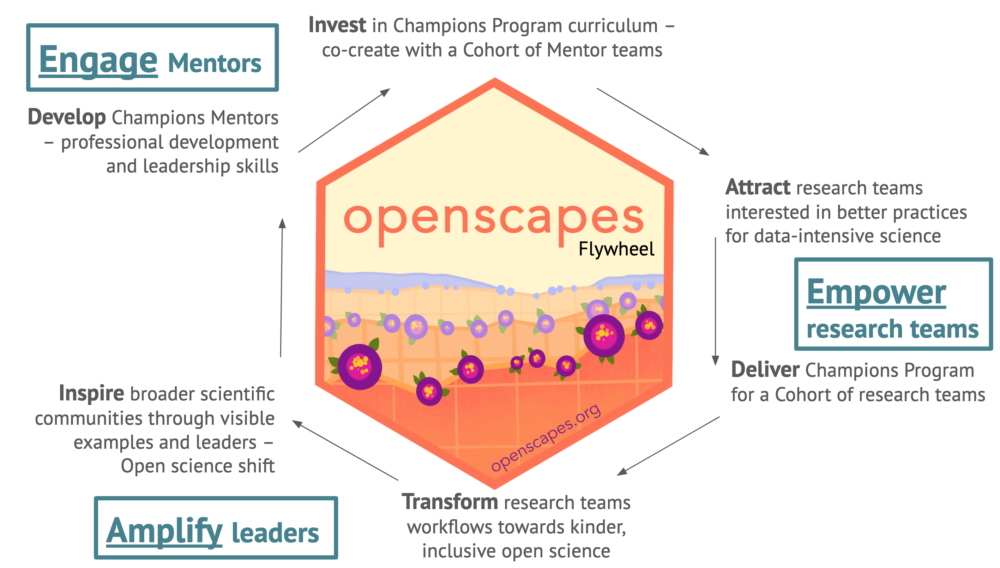
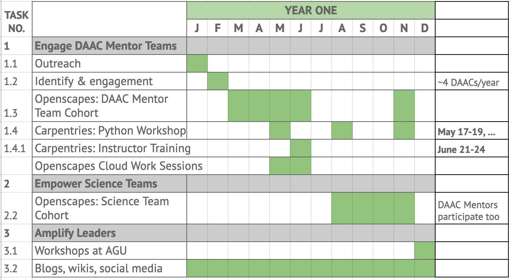

```{r setup, include=FALSE}
knitr::opts_chunk$set(echo = FALSE)
```

## Openscapes

Openscapes champions open, inclusive practices in environmental and Earth science to help uncover data-intensive solutions faster. We do this through mentorship, coaching, training, and community organizing, leveraging existing resources from open communities along with our own. 

Our [flywheel](https://www.jimcollins.com/concepts/the-flywheel.html) shows our approach to engaging, empowering, and amplifying research communities in open data science.




<!---https://docs.google.com/presentation/d/14Ko80NL1qA3KsH0Spgym20DXp5ZLn6zE2KOuqUTNMVA/edit#slide=id.gc846ffc89f_2_32--->


## The NASA-Openscapes project

**The overarching vision** is to support scientific researchers using NASA data as they migrate their workflows to the cloud. We are doing this working with NASA Distributed Active Archive Centers (DAACs) over three years by:

1.  Developing a cross-DAAC Mentor community that supports growth into confident cloud data instructors, and create, curate and use shared resources and have a tutorial review process

2.  Empowering science teams to experiment migrating their download-intensive data analysis workflows to the cloud through a partnership with Carpentries and 2i2c

3.  Scaling the Openscapes Champions science cohorts with DAAC Mentors to support and amplify as many open science leaders as possible, transforming their workflows towards open, kinder science and the cloud

## Timeline

This is the timeline for Year 1, which we will repeat in Years 2 and 3 as Mentors increasingly lead science cohorts at their own DAACs.



## Slides

-   [NASA DAACs Openscapes Framework](https://docs.google.com/presentation/d/1_2ybhWlbg_Y_NrTQ_FF8JqqmbsstCkt5IKZqHmwDtFg/edit?usp=sharing) - March 25, 2021: NASA ESDS-ESDIS-DAACs-IMPACT Meeting

<br>

## Project Leads

**Julia Stewart Lowndes, PhD**

National Center for Ecological Analysis and Synthesis (NCEAS) 

University of California Santa Barbara (UCSB)

[lowndes at nceas.ucsb.edu](mailto:lowndes%20at%20nceas.ucsb.edu); [\@juliesquid](https://twitter.com/juliesquid)

<br>

**Erin Robinson, MSc**

Metadata Game Changers

[erin\@metadatagamechangers.com](mailto:erin@metadatagamechangers.com); [\@connector_erin](https://twitter.com/connector_erin)

<br>

**Amanda Tan, PhD**

eScience Institute

University of Washington

[amandach\@uw.edu](mailto:amandach@uw.edu)

\

## Learn More

-   [earthdata.nasa.gov](https://earthdata.nasa.gov/)

-   [openscapes.org](https://openscapes.org)
