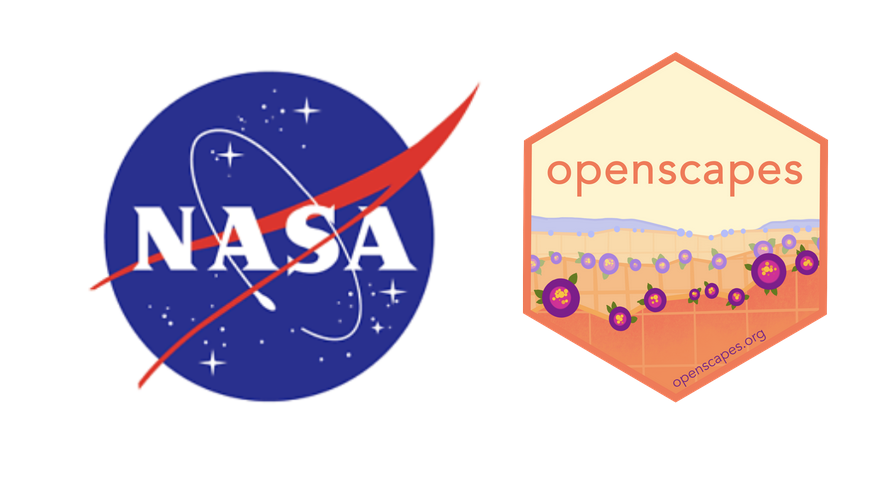
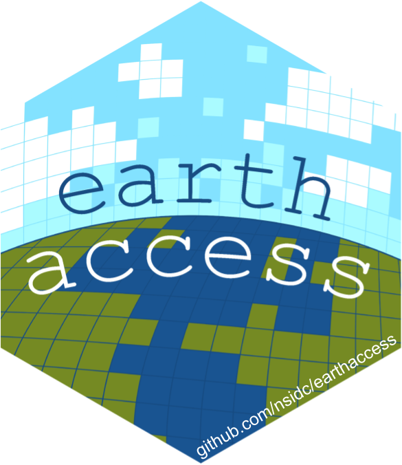
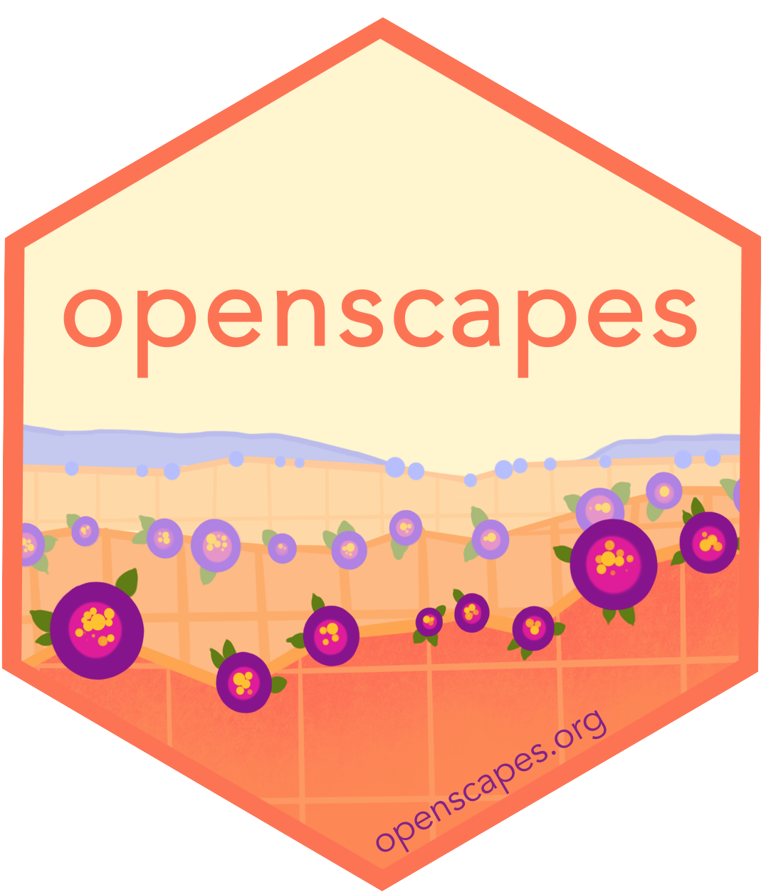

<h1>NASA Openscapes</h1>

 

Earth science is changing. We support scientists using data from NASA Earthdata served from the Distributed Active Archive Centers (DAACs) as they migrate workflows to the cloud.

We are influenced and inspired by many leaders and community organizers, particularly in the climate and get out the vote movements. That means, we know this isn't just about us or an effort we can do alone. We are always looking to learn from, with, and for others.

**News and Upcoming Events:**

- [Monday Hackday at ESIP Summer Meeting](news/2026-07-27-esip-hackday/), July 27. Theme: ‘Making Things Easier for Scientists’

- [Openscapes at the ESIP Summer Meeting](news/2026-07-28-esip-summer/), July 2026.

- [Monday Hackday at UWG Summit.](news/2026-08-17-uwg-summit/) Theme: ‘earthaccess hackday’

- [NASA Openscapes Champions Program, June 2026](news/2026-06-03-suborbital-champions/). An Openscapes Cohort to learn open science approaches for your daily workflows with NASA airborne and other suborbital data. Summary post coming soon.

- Recording & resources from [Greg Leptoukh Lecture Reprise by Julie Lowndes](news/2026-01-15-agu-leptoukh-award-julie-lowndes/)

- Recent workshops

  - [Airborne Data Applications for Invasive Species Mapping](news/2025-09-30-ornl-arset-workshop/)

Learn about our recent work: [News](news.qmd) • [Presentations](/about.qmd#slides) • [Flywheel Preprint](https://nasa-openscapes.github.io/about.html#flywheel-preprint) • [White Paper: The Value of Hosted JupyterHubs](https://nasa-openscapes.github.io/about.html#white-paper-value-of-hosted-jupyterhubs)

{fig-alt="hexagonal earthaccess logo, an illustrated earth as pixels with blue text arcing across" fig-align="left" width="30"} [earthaccess](https://earthaccess.readthedocs.io/en/latest/) python library • [Earth Science Data Simplified](https://www.earthdata.nasa.gov/learn/blog/earthaccess) (NASA Earthdata blog!)

{fig-alt="hexagonal Openscapes logo" fig-align="left" width="30"} [openscapes.cloud](https://openscapes.cloud) - A central location for Openscapes JupyterHub access and fledging information.

Project announcements: [NASA](https://earthdata.nasa.gov/learn/openscapes) • [Openscapes](https://www.openscapes.org/blog/2021/03/10/nasa-announcement/) • Please connect with us on Mastodon [\@openscapes\@fosstodon.org](https://fosstodon.org/@openscapes) or join [our newsletter](https://docs.google.com/forms/d/e/1FAIpQLSdgVXRp3V-w94GPWkR31RUfyBl37EphdQSlCOcnyeNlf8OLWw/viewform)
