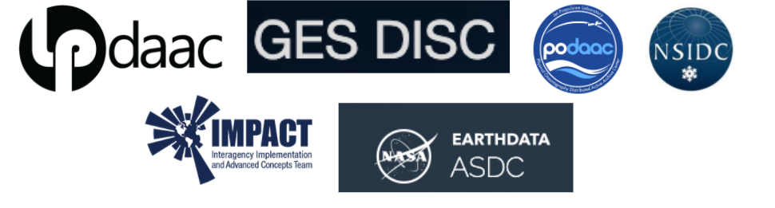

```{r setup, include=FALSE}
knitr::opts_chunk$set(echo = FALSE)
```

# Mentor Cohort Activities

## 2021

**Our immediate activities with the Mentors are:**

-   Build a DAAC community of practice through our twice monthly Openscapes Cohort Calls, a Carpentries Intro Python/Git Workshop, and Carpentries Instructor Training
-   Develop participating teams as Mentors and help them practice teaching in a style to prepare them for a workshop at the American Geophysical Union Conference (AGU) (Dec) and the Openscapes Champions cohort with research teams (early 2022)
-   Support Mentors towards establishing a common set of tutorials that they can then build off their DAAC-specific and science examples

<br>

### 2021 Cloud Hackathon

The **Cloud Hackathon: Transitioning Earthdata Workflows to the Cloud** is a virtual 5-day (4 hours per day) collaborative open science learning experience aimed at exploring, creating, and promoting effective cloud-based science and applications workflows using NASA Earthdata Cloud data, tools, and services (among others), in support of Earth science data processing and analysis in the era of big data. All details and tutorials are available at: <https://nasa-openscapes.github.io/2021-Cloud-Hackathon/>.<br>

### Mentors Cohort Calls Summaries

We will have Cohort Calls with the DAAC Mentors throughout 2021. Linked below are blank Agendas that are then copied and used for live note-taking.

-   [**Call 1 Agenda**](https://docs.google.com/document/d/1N57rC4Sj162VO3KmBibpV8Py8zA9YleQuMm5_7QFeLo/edit?usp=sharing): We started working towards a common understanding of how open science leads to transformational, better science in less time and develop our plan as a Cohort

    -   Slide Decks:
    -   [Empowering Transformational Science](https://docs.google.com/presentation/d/1SUMiQg0HhD19H-D6DDzTrFQVzub0kOINwJBG59uQCTw/edit#slide=id.p1) - Chelle Gentemann
    -   [Better science in less time & Openscapes mindset](https://docs.google.com/presentation/d/112Ci1fEaVes6KXPNrJBVjTMrny7j5XM9Giphc3hIMo0/edit?usp=sharing) - Julie Lowndes

-   [**Call 2 Agenda**](https://docs.google.com/document/d/15mtVW0IwD85kmkeJ2UPxfbzzwpNcI2JVP7R-QIPf4b8/edit?usp=sharing): We heard about each other's work more and start discussing creating cloud tutorials and thinking about next steps

    -   Resources:
    -   [Pathways Template](https://docs.google.com/spreadsheets/d/1NTdNKYLzBz8YDyt4cBVNDkF-aaH6V453yJDD6ljrhq4/edit?usp=sharing)

-   [**Call 3 Agenda**](https://docs.google.com/document/d/12TiW14wXcKkrXBYMCAjKv2igdvhIea81CUxSf2sV6e8/edit?usp=sharing): We discussed how the group would like to work together to create teaching materials, and discussed a teaching model for future sessions

-   [**Call 4 Agenda**](https://docs.google.com/document/d/1Mzs7kNU7kfj6o-P40fl0ojgXlhw7TiUweZsk3kxZmG4/edit?usp=sharing): We will discuss how data + common resources + custom tutorials = science users starting to migrate workflows to the cloud, and the LP DAAC will lead a teaching demo

    -   [GitHub Clinic \#1](https://docs.google.com/document/d/1puf1UG7HVwZwnbfc0mlBIzCSGvc-99TcTOdmPHzqZc4/edit?usp=sharing): GitHub for collaborative research through publication and project management, through hands-on practice from the browser
    -   Work Session: LP DAAC

-   [**Call 5 Agenda**](https://docs.google.com/document/d/1KwBucWKn7YFrfBs0eF8n3ZYCGcLCdKjy28UzMyP84d4/edit?usp=sharing): We heard the IMPACT share about their tutorial process, LP DAAC gave updates from their Work Session, and we did intro demos & planning with 2i2c, Jupyter Hubs, and our NASA-OpenscapesGitHub Organization

    -   [GitHub Clinic \#2](https://docs.google.com/document/d/1VXgSPKZJhz7A6KgQPQ1_gpzs_SeXT7Voq_UPHFJq0mw/edit?usp=sharing): We demoed and practiced GitHub's branches, pull requests, and project boards to collaborate and stay organized from the browser.

-   [**Call 6 Agenda**](https://docs.google.com/document/d/1R7P8sC21TWW0rIqMIv6lBrZxfRzt09g2QRd7VuV4cJU/edit?usp=sharing): NSIDC and PODAAC teams shared about their tutorial process, and we discussed plans forward with Jupyterbooks, 2i2c, Carpentries, and the upcoming Science Champions

    -   Work Session: PO.DAAC

-   [**Call 7 Agenda**](https://docs.google.com/document/d/1x3T46lQ6wvWNgQ8l4RhzgiT0P5b8CbpwILNlq_mTXyI/edit?usp=sharing): We shared our pathways forward, discussed plans for the Science Champions cohort and how to contribute to our tutorial book.

    -   [Cookbook Workflow Clinic \#1](https://docs.google.com/document/d/1iUZAZu3rtKppg_lTKwcpQ-aYxBaCBxkhxrx07LVIvFk/edit?usp=sharing): We demoed and practiced contributing to our tutorial Cookbook with Quarto + GitHub
    - Carpentries Instructor Training, 9 Mentors participated

-   [**Call 8 Agenda:**](https://docs.google.com/document/d/152n4kEmHhWdt2Sqh07ep3ld9tA29VriCIcVOiPlaBcI/edit#) The main focus of this call was to recap the Mentors experience with Carpentries Instructor Training and a Cookbook Work Session; Julie demoed and the group discussed and practiced pushing their work to a branch and creating a pull request

    - Co-working sessions

- [**Call 9 Agenda:**](https://docs.google.com/document/d/1zbr1rmUpimcNgAzlt6qaDjqN7xfilpvTiyCS1Yx2xv8/edit?usp=sharing) Cookbook Co-Work Session; we’ll discuss, demo, and work!

    - Co-working sessions
    
    
- [**Call 10:**](https://docs.google.com/document/d/16C-5QbZ8LR_RJUXNGcxvhlWF747tFG-aJr-lsgYIO-w/edit#)

    - Co-working sessions

- **Late Summer and Fall**: We are preparing for the 2021 Cloud Hackathon, and using our Cohort Calls and additional Co-working sessions to develop and practice tutorials. Learn more: <https://nasa-openscapes.github.io/2021-Cloud-Hackathon>

# Mentor Cohort 2021



### Andy Barrett

### Aaron Friesz

Aaron Friesz is the Science Coordination Lead at NASA's Land Processes Distributed Active Archive Center (LP DAAC). In his role, Aaron provides user needs insights and technical support for archive and distribution, service development, and outreach activities. He develops tutorials, scripts, and presentations that highlight the use of land remote sensing data in analysis workflows. More recently, his work has focused on advocating for the uptake of cloud computing in the land remote sensing community.

### Shubhankar Gahlot

### Iksha Gurung

### Alexis Hunzinger

### Luis Lopez

### Catalina Oaida

[**Catalina M. Oaida, PhD**](https://www.linkedin.com/in/catalina-oaida-1128b488/) is an Applied Science System Engineer at NASA's JPL (and PO.DAAC), combining hydrology and Earth science domain expertise (science researcher by training) with a system engineering perspective. Focus on broadening the user base for NASA Earth observations and remote sensing data in the Cloud, and helping increase discoverability, accessibility and usability of these data for the science research and applications communities, and enabling shorter "time to science". Reducing those barriers to science when data and services are in the cloud, while recognizing that there is a great diversity in user needs, experiences, domain expertise, access to resources - create and implement a comprehensive plan to ensure as many of these user 'types' are supported. Develop science use cases as training examples, leveraging open data and open science (and tools). Learning from others and co-creating.

### Jack McNelis

Jack McNelis is a Science Applications Software Engineer at NASA Jet Propulsion Laboratory (and the PO.DAAC) with experience leveraging EOS data for rangeland ecosystem monitoring applications. He develops and curates metadata to describe PO.DAAC data holdings, and to better integrate them with data delivery services and end user softwares. He also develops resources for users to be better prepared to implement their analyses in the cloud.

### Muthukumaran Ramasubramanian 

### Christine Smit


### Amy Steiker

Amy Steiker is the NSIDC DAAC Data Services Engineer, specializing in the development and management of data education resources, tools, and services for NSIDC DAAC's growing user community, as well as data transformation service development for NASA EOSDIS. She is excited to join this first Openscapes cohort to work together with our science communities to develop and sustain tooling that supports their data processing workflows as they transition to the Earthdata Cloud.


### Makhan Virdi

[Makhan Virdi](https://www.linkedin.com/in/mlvirdi/) is the ASDC DAAC Scientist, experienced in creating geospatial tools and services for science-based analysis, visualization (UI/UX), discovery and distribution of data generated by field/laboratory observations, remote sensing, and model simulation. He is interested in AI/ML for earth science data, multi-sensor data fusion, and data analytics in the cloud. He is excited to be part of the Openscapes community, and is looking forward to learning from peers, and sharing his knowledge and skills with the community to develop and promote data science techniques, best practices, and inter-agency collaborations.


## Past Participants

### Jennifer Adams

GES DISC

### Vishal Bagadia

[Vishal Bagadia](https://www.linkedin.com/in/vishal-bagadia-a98b95113) is a data science analyst working on contract at the Atmospheric Science Data Center DAAC, NASA Langley Research Center. His experience in exploring emissions retrievals from satellite missions and guiding science teams during the development of their research products powers his work on addressing data interoperability concerns and being responsive to user's engagement with the archived data. He is energized in leveraging emerging, free, and open-source technologies to better represent and visualize large datasets, building web applications to meet user's data transformation and accessibility needs, and ultimately producing sustainable solutions to meet end-user requirements as data moves into the cloud.

### Cole Krehbiel

[**Cole Krehbiel**](https://www.linkedin.com/in/cole-krehbiel-6573469a/) is a remote sensing data scientist working as a contractor to NASA's Land Processes Distributed Active Archive Center (LP DAAC). He is interested in improving access to geospatial data for diverse user communities. Cole supports missions archived and distributed by the LP DAAC including MODIS, VIIRS, ASTER, ECOSTRESS, and GEDI by creating Python tutorials and data prep scripts and providing workshops and webinars to facilitate community uptake and understanding of those missions.

### Paul Moth 

Paul Moth is a Data Support Specialist at the National Snow and Ice Data Center Distributed Active Archive Center (NSIDC DAAC). He is part of the User Services team and currently represents MODIS, VIIRS, SMAP, High Mountain Asia, and Nimbus missions at NSIDC DAAC. He is interested in working with early adopters and science team members and gathering feedback that identifies the key operations/steps/workflows that would be most important for creating tutorials and educational materials.

### Matt Tisdale

[Matt Tisdale](https://www.linkedin.com/in/matt-tisdale-5874745/) is a data scientist working at the NASA Atmospheric Science Data Center (ASDC). He is interested in improving access to ASDC satellite and airborne data products. He uses ArcGIS, OPeNDAP, Python, and Jupyter notebooks to show users how to obtain and analyze data from ASDC. I am interested in learning more cloud analysis techniques to share with our user base as more and more of our ASDC data products are migrated to the cloud.
