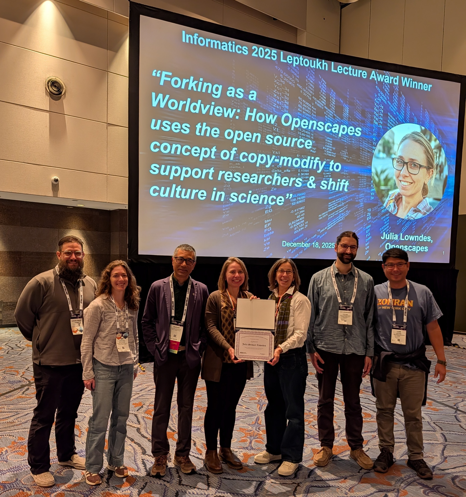

*Cross-posted at* [openscapes.org/events](https://openscapes.org/blog)*, [nmfs-openscapes.github.io/blog](https://nmfs-openscapes.github.io/blog)*, [*nasa-openscapes.github.io/news*](https://nasa-openscapes.github.io/news.html).

------------------------------------------------------------------------

At the AGU 2025 Fall Meeting Julie Lowndes, Openscapes founding director, received the [AGU Greg Leptoukh Lecture Award](https://www.agu.org/honors/leptoukh). This award celebrates the life of an inspiring Earth scientist in our community and recognizes significant contributions to informatics, computational, or data sciences through research, education, and related activities.

We're lucky that Julie will give her talk again so we can all tune in. It will be recorded.

**Date**: March 19, 2026\
**Time**: 10:00 am Pacific Time; 1:00 pm Eastern Time\
**Where**: remotely, [via Zoom](https://agu.zoom.us/j/99945375572?pwd=sdDH5cy8uvnwy5DaTub1MkJdNjdkI9.1)

This represents so much shared joy from our community, including the nomination by NASA Mentors + Allison Horst, and co-authoring with the Openscapes core team. Details with the official AGU citation, Julie's abstract, and slides are [posted](https://openscapes.org/blog/2026-01-15-agu-leptoukh-award-julie-lowndes/).\

::: {style="text-align:center;"}
{fig-alt="6 women and men smiling, wearing conference lanyards, standing in front of a large screen projecting a headshot of Julie Lowndes and her talk title Forking as a worldview: How Openscapes uses the open source concept of copy-modify to support researchers & shift culture in science" fig-align="center" width="50%"}
:::
