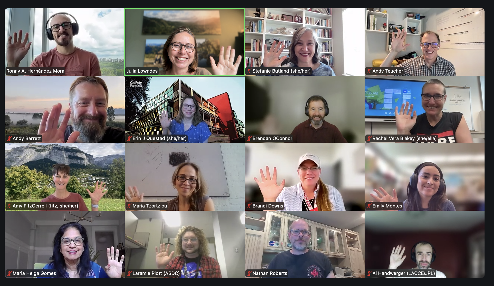
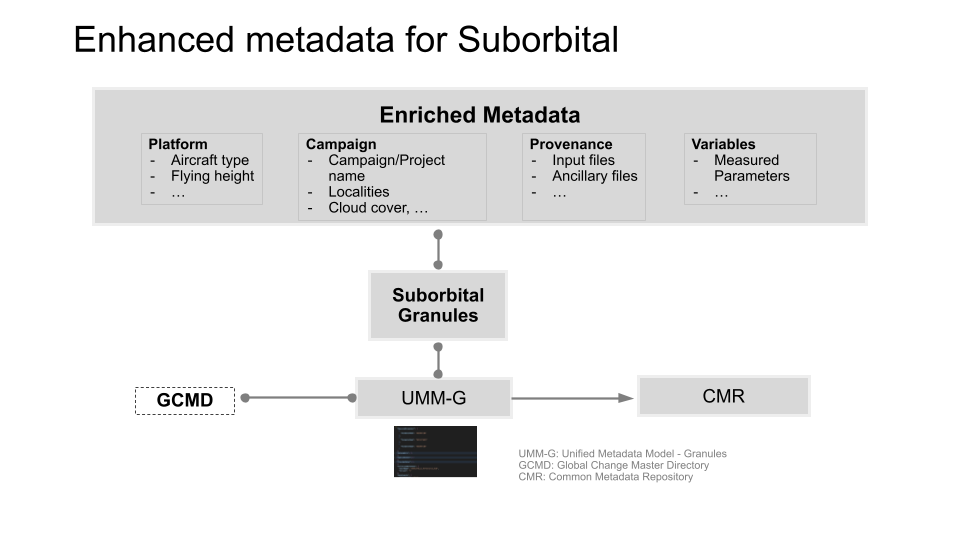

*This spring we had our 2026 NASA Champions Cohort (aka Openscapes Suborbital Clinic) with a twist: 4 sessions over one month with a suborbital emphasis. Most of our lessons were taught as usual, with NASA Openscapes Mentor Ian Carroll (OB.DAAC) presenting the Better Science lesson in the first call. We also included 2 new lessons: Metadata strategies for suborbital data by NASA Openscapes Mentor Rupesh Shrestha (ORNL) and Documenting with notebooks by Openscapes’ newest team member Ronny Hernandez Mora! We planned and led this Cohort on a short timeline to maximize early availability by the EVS-4 science teams. We plan to host biweekly coworking with EVS-4 teams (it’s ok if team members didn’t participate in Champions!) and NASA Mentors, starting in September. There are some shared needs already surfaced and we’ll see what folks want to prioritize and how we can support.*

*Quicklinks:*

- *Cohort webpage: [https://nasa-openscapes.github.io/2026-nasa-champions/](https://nasa-openscapes.github.io/2026-nasa-champions/)*   
- *Better Science for Future Us ([slides](https://openscapes.github.io/series/core-lessons/guest-instructors/better-science-2026-06-03.html#/title-slide), [video](https://www.youtube.com/watch?si=utRv6sqsELhaecNn&v=aDeXqxkgYYM&feature=youtu.be&themeRefresh=1)), by [Ian Carroll](https://science.gsfc.nasa.gov/sci/bio/ian.t.carroll) Associate Research Scientist at the University of Maryland Baltimore County working for NASA Goddard Space Flight Center.*  
- *Metadata for Suborbital Data Publication ([slides](https://docs.google.com/presentation/d/1-flozA_ph9tBzqatoOs69lD8NpcfiIZ6VFeP2MDINmk/edit?slide=id.g3f173a351bb_1_137#slide=id.g3f173a351bb_1_137)*, [*video*](https://drive.google.com/file/d/19trpyeo4DAV3qtFi-Cje_CWGUoqlPP0o/view?usp=sharing&t=345.229)*), by [Rupesh Shrestha](https://www.ornl.gov/staff-profile/rupesh-shrestha) and [Michele Thornton](https://www.ornl.gov/staff-profile/michele-m-thornton) research staff scientists at Oak Ridge National Laboratory (ORNL), and [NASA Openscapes](https://nasa-openscapes.github.io/) Mentors.*  
- *Project overview blog: [Supporting NASA suborbital science teams to develop reproducible workflows](https://openscapes.org/blog/2026-03-03-suborbital/)*

*Cross-posted at *

------------------------------------------------------------------------

## NASA Openscapes Mentors supporting suborbital teams

The [NASA Openscapes](https://nasa-openscapes.github.io/) Mentor community
includes people across NASA Earth science data centers (DAACs) that collaborate
to deliver work aligned with NASA ESDIS goals to enable science, enriched by
coordinating with the open science community beyond NASA. They have created
“go-to” resources for all users of  NASA Earthdata – such as the
[earthaccess](https://earthaccess.readthedocs.io/) Python library and tutorials
in the [Earthdata Cloud Cookbook](https://nasa-openscapes.github.io/earthdata-cloud-cookbook/). Over
the last five years, Mentors have developed these resources as a supportive
community in response to teaching hundreds of NASA Earthdata users via
workshops and events together, where they identify and rapidly respond to
common needs then iterate through active use, documentation, and further
teaching.

This spring NASA Openscapes Mentors focused on supporting the Suborbital
Community, focused on the Earth Venture Suborbital
[EVS-4](https://essp.nasa.gov/earth-pathfinder-quests/projects/earth-venture-suborbital-evs-4/)
Mission teams. [NASA Earthdata](https://www.earthdata.nasa.gov/) has volumes of
remote sensing data collected by platforms in space, air, water, and land.
Substantial [suborbital data](https://science.nasa.gov/researchers/suborbital/)
is collected from measurements via airplanes, ground networks, and field
measurements on land, boats, and buoys. Suborbital science teams are teams that
create and use suborbital data via NASA programs like EVS-4. The science teams
use suborbital data to calibrate and validate satellite data, as well as to
conduct other awesome research linked to understanding complex local processes
([About the Airborne Science Program](https://airbornescience.nasa.gov/)) like
studying Arctic coastlines via the [Frontlines of Rapidly Transforming
Ecosystems (FORTE) mission](https://espo.nasa.gov/forte) and glaciers and ice
sheets via the [Snow4Flow mission](https://snow4flow.lpl.arizona.edu/). NASA is
also currently developing a SoAR (Suborbital Archive Readiness) Team and other
parts of NASA to collaborate across the agency to support science teams. This
Cohort was an opportunity to begin onboarding the SoAR team as NASA Openscapes
Mentors. See further details in  our project overview blog: [Supporting NASA
suborbital science teams to develop reproducible
workflows](https://openscapes.org/blog/2026-03-03-suborbital/).

This Champions Cohort had a good diversity of EVS-4, DAACs, and SoAR team
members., PIs from the EVS-4 projects FORTE and Landslide Change
Characterization Experiment ([LACCE](https://essp.nasa.gov/lacce/)) and the
Deputy PI for Snow4Flow participated. It felt like the “timing is right” for
these people to all be together. NASA Openscapes Mentors Ian Carroll (OB.DAAC)
and Rupesh Shrestha (ORNL) taught great lessons that resonated with the
participants, and developed materials to reuse.

::: {style=""}
{fig-alt="video conference participants in grid. People are smiling and waving" fig-align="center" width="70%"}
:::

## Impact: What participants learned

::: blockquote-blue
> *“My big takeaway is that Open Science happens by choice, but that choice is a bunch of small choices such as file naming conventions, appropriate metadata, and inclusiveness.”* - from our shared notes doc in the 2026 NASA Openscapes Champions Cohort
:::

Across all sessions’ discussions and notes, one theme was repeatedly mentioned
in one way or another: the importance of documentation. Documentation can take
many forms such as issues on a platform like GitHub, as README files in project
repositories, as notebooks that explain code or onboarding procedures, as
metadata with consistent annotations, or as online handbooks describing team
culture and workflows.  Regardless of the format, documentation helps make
knowledge accessible and visible. Instead of information living in the mind of
only a few individuals, it can become a shared resource that anyone in the team
can learn from, contribute to, and improve over time. By documenting workflows
and practices openly, teams can create systems that are easier to maintain,
adapt, communicate and improve over time.

This idea of documentation was embedded across all sessions. From Call 1 we
gained a better understanding about the **Openscapes Mindset**: How to make our
open science pathway enjoyable, how to collaborate better, communicate, share
our progress and encourage our peers\! We also explored the topic of “**Better
Science for Future Us”** with practical examples and experiences from real life
shared by Ian Carroll from OB.DAAC. With a better understanding of the mindset
we focused on **Project Management** during Call 2\. Here we learned how to
combine all the moving parts of a research project (tasks, data management,
code, and team work) in a centralized space where we can have asynchronous
communication. This is where a platform like GitHub comes in handy. We
practiced how to use the web interface, create markdown documents, understand
what are issues, how we can describe a task, tag team members, use labels,
establish priorities, and last but not least, to use emojis as a way to quickly
communicate I agree / I’m reading this / disagree / good job and so on.

During Call 3 we learned that team work requires more than collaborative tools
and well defined workflows. Their effectiveness depends on the people using
them and the **Team Culture.** One of the central topics was psychological
safety: creating a space where team members feel comfortable asking questions,
sharing ideas, expressing concerns, and making mistakes without fear of any
judgement. The discussions emphasized the important role that leaders play in
setting the tone and encouraging a culture of trust, collaboration, and
inclusion. We also explored **Documentation with Notebooks** and the main areas
of documentation: team, project, data, and code management. Even when we can
use different tools for each of those areas, the emphasis was on notebooks due
to their usefulness by allowing us to combine narrative text with code,
visualizations, and results in one place. Also we can take advantage of
publishing tools available on GitHub to transform local notebooks into a
website and online books that can be easily shared across team members. 

In our last session we learned a lot about metadata and how important it is for
any mission and research project, but even more when you are working with NASA
suborbital data due to the high variability in how it is collected\! The lesson
**“Metadata for Suborbital Data Publication”**  was facilitated by Rupesh
Shrestha and Michele Thornton of ORNL, who taught us what metadata is, the role
of structured and standardized metadata,  and how it improves data
discoverability and data usability. We also learned about concepts such as data
collection, data granules, and explored the enriched metadata requirements
commonly associated with suborbital datasets. Participants said this was an
important overview and good timing to be thinking about metadata as they are at
the beginning of their missions. 

We received good feedback in the sessions and the survey, including:

* “It made me more comfortable with suborbital data which will make my work as
a data curator much easier.”  
* “Better standardization and documentation to help my future self and others
as they join the team.”
* “This is exactly what is supposed to happen: celebrate that NASA Openscapes
provided the expertise and program to bring together different suborbital groups.”

## What we did: NASA Champions Cohort overview

This NASA Openscapes Champions Cohort took place over 4 weekly virtual sessions
([digest\_1](https://github.com/NASA-Openscapes/2026-nasa-champions/issues/5),
[digest\_2](https://github.com/NASA-Openscapes/2026-nasa-champions/issues/26),
[digest\_3](https://github.com/NASA-Openscapes/2026-nasa-champions/issues/27),
[digest\_4](https://github.com/NASA-Openscapes/2026-nasa-champions/issues/28)).
This was a compressed and lightly modified version of our normal series,
tailored for suborbital science teams. Each cohort call included a welcome and
code of conduct reminder and two teaching sessions with time for reflection in
small groups or silent journaling and group discussion before closing with
suggestions for future team meeting topics (“Seaside Chats”), and Open Science
Tips. All topics and the slides presented are shared on the [2026 Cohort
page](https://openscapes.github.io/2026-esa/). 

Openscapes lessons develop mindsets around “Future Us” (working for yourself
with an eye towards other contributors) and “Forking as a worldview” (expecting
that the thing you need exists, finding it and crediting it, and building from
it, openly). We taught most of the [core
lessons](https://openscapes.github.io/series/what-to-expect.html#cohort-calls):
Open mindset; Better science for future us; GitHub for publishing & project
management; team culture – which Openscapes has refined in previous 30
Champions Cohorts. We also had key iterations to the series: 

* **Better science for future us:** This lesson was contributed by Ian Carroll
(OB.DAAC, details in Quicklinks above). Ian used the powerful analogy of moving
from being a trail user to a trail maintainer to illustrate what it means to
gradually step-up your participation in open science.   
* **Documenting with notebooks:** This is a new lesson where we covered areas
of documentation, tools to document, and the importance of making documentation
part of daily workflows. We put emphasis on notebooks such as Quarto or
Jupyter, and on taking advantage of  available tools from GitHub to publish the
notebooks as webpages making them easier to share, communicate, and maintain
across a team.   
* **Metadata for suborbital data publication:** This lesson focused on the role
of metadata for subortbital data and was contributed by Rupesh Shrestha and
Michele Thornton (ORNL DAAC) – and is full of useful links. Because suborbital
observations are collected under highly variable conditions, enriched metadata
plays an important role to describe the context of the data. For example, the
same instrument can fly on different platforms, at different altitudes, swath
widths, and pixel sizes. Calibration parameters may vary across campaigns, and
factors such as aircraft movement, weather, and lighting conditions can affect
the observations. Enriched metadata captures these details, supporting data
interpretation, discoverability, and reuse.

::: {style=""}
{fig-alt="Conceptual flowchart showing enriched metadata about the platform, campaign, provenance, and measured variables associated with suborbital data granules. The granule metadata is represented using UMM-G, connected with GCMD terminology, and submitted to NASA’s Common Metadata Repository." fig-align="center" width="80%"}
:::

This Champions cohort was also used as onboarding for new NASA Openscapes
Mentors \- Brandi Downs (PO.DAAC), Nathan Roberts (LP DAAC), and Mikala Beig
(NSIDC, who has been a Mentor but not in a cohort before \- she had good
insights in debriefs). This is an approach that has been successful for years
of NOAA Fisheries Champions Cohorts, but is not something that we have done
explicitly with NASA. 

Across all sessions, we established and reinforced the Openscapes mindset. This
mindset is not always taught explicitly, but rather it is experienced through a
set of practices and workflows that are consistently applied throughout the
cohort. These practices are intentional and are part of the Openscapes culture. 

One clear example is the use of shared agenda documents,  where all the
participants have editing permissions. The agenda documents have a structure
containing links to materials, spaces for questions, notes, reflections, and
serve as a shared record of the cohort’s progress. This is a transparent and
participatory approach to communication and documentation. 

Another practice is being intentional about time. Sessions start and finish on
schedule; how much time is allocated to each activity is communicated, and any
changes to the agenda are discussed with the participants during the sessions
(i.e. taking a bit of more time to discuss a topic that generated interest, and
reducing that time to another activity which we can lower priority). This helps
to create a respectful environment where everyone’s time is valued. We do this
by crossing out times (command-shift-x in Google Docs) and rewriting new times
in the Google Doc, which openly communicates time changes to the facilitators
and participants at the same time.

Slides, notes, and all the learning materials all shared openly with the
participants. This openness encourages participants to revisit, reuse, adapt,
contribute, and share the materials with other colleagues. Rather than treating
the materials as “use and consume once”, [Openscapes promotes a culture of
reuse and
adaptation](https://openscapes.org/blog/2026-01-15-agu-leptoukh-award-julie-lowndes/).
Equally important as sharing materials is ensuring that they are easy to find
and access. All the links to the agendas, slides, lesson materials, online
books, and the Code of Conduct are provided in multiple locations throughout
the cohort materials. These multiple entry points ensure that participants can
easily find what they need and reduce barriers to participation.

Regular and clear communication through different channels also helps
participants to stay informed and connect throughout the cohort. Equally
important is the effort to create a safe and welcoming space where people feel
comfortable contributing to discussions, asking questions, and sharing
experiences. This is supported through intentional practices such as
recognizing the unique experiences participants bring and inviting them to
share them with the group. By opening the questions to the entire cohort,
Openscapes reinforces the idea that expertise is distributed across the group
and that learning is a collaborative effort.

This cohort was also an opportunity to continue codifying our pre-cohort
engagement infrastructure, which we were developing and testing alongside our
first cohort with the European Space Agency (blog post: [On-ramp to FAIR data
in the EarthCODE Federation Recap of our first ESA Openscapes Champions
Cohort](https://openscapes.org/blog/2026-06-30-esa-champions-2026/)). This work
was co-led by Stef Butland and Julie Lowndes and includes a new Cohort
Engagement Sheet and section in our [Approach
Guide](https://openscapes.github.io/approach-guide/champions). Relationships
matter here, so much. We approach engagement from a mindset that the awesome
scientists in our Cohorts want to learn, don’t fear change, but are very
limited on time. The antidote to this challenge is trust. We worked with NASA
EVS-4 leadership to give presentations at monthly EVS-4 meetings to share the
opportunity. Julie also reached out and met EVS-4 PI Maria Tzortziou at the
Ocean Sciences Meeting in Glasgow in February to share the early plan and
welcome the FORTE team to join. Maria and 7 other team members joined from
FORTE.

In this Cohort, we did not include Pathways presentations, since it was both a
compressed timeline (1 month, not 2\) and fewer calls (4, not 5). We used the
Reflections Program prompts to help people with their Pathways Sheets in the
in-between weeks, and will support folks in Coworking in the Fall instead of
during the off-weeks between Cohort Calls. Additionally, this Cohort was a
milestone for the Openscapes team: Stef led (“held”) the whole Cohort planning,
onboarding Ronny to all the processes and supporting him and Andy to develop
and deliver the Cohort, including coaching guest speakers and weekly digests.
Julie led the engagement work with EVS-4 teams and then attended 3 of the 4
sessions to support live and listen rather than to lead.

## EVS-4 teams, please join us for further support in Coworking Fall 2026!

To continue making progress and connections within and across EVS-4 teams and
NASA Mentors, we will host biweekly NASA Openscapes Coworking sessions from
**September to December, on Wednesdays, from 10:30am \- 12pm PT**. These are
drop-in and open to anyone on EVS-4 teams – bring a colleague\!

Coworking sessions provide a space to work on your own projects while
benefiting from shared experiences and support from others working on similar
challenges. We will create breakout rooms around the themes people work on, and
will have Openscapes staff and NASA Openscapes Mentors available to mentor and
develop as needs emerge. During the cohort sessions, some topics were suggested
as areas where additional support could be valuable such as:    

* **Shared, open documentation with notebooks (Quarto, Jupyter)**   
  * How to create notebooks  
  * How to render notebooks locally (and what does this mean\!)  
  * How to “deploy” notebooks as a website  
  * Changing/updating notebooks  
  * Work as a team in a notebooks (version control)  
* **Collaboration in the cloud with data**  
  * Data formats (cloud optimized, etc)  
  * GitHub not for hosting data but for code and documentation
* **Project management with GitHub**  
  * Issues priorities  
  * Canvas  
  * Communication through issues vs messages on slack  
  * Best practices for creating READMEs  
* **Visualizations**, [like this one for BioSCape](https://popo.jpl.nasa.gov/mmgis-aviris/?mission=BIOSCAPE). It’s open source ([github repo](https://github.com/NASA-AMMOS/MMGIS)) so FORTE could fork and customize it. This is promising; visualizations are something that teams ask for often. However, a caution that before the metadata is finalized, it is difficult to visualize. 

We also invite you: **Openscapes will host a Community Call this Fall about AI
and Open Communities**  ([planning issue](https://github.com/orgs/Openscapes/projects/13/views/2?filterQuery=community&pane=issue&itemId=192771689&issue=Openscapes%7Chow_we_work%7C475)
open to comments; stay tuned). These conversations will bring together people
from different organizations to discuss how AI has impacted open communities,
the role of communities beyond being a convenor for technical information
exchange and learning, and how communities can adapt to continue to welcome and
support people.

## Related posts

* [Thoughts from NASA Champions 2025 \- A welcome to NASA Earthdata and earthaccess](https://nasa-openscapes.github.io/news/2025-11-27-nasa-champions-2025-summary/)  
* [NASA Champions 2024: Data strategies for when to use cloud, coding strategies for parallelization, & first examples of big science in the Cloud](https://nasa-openscapes.github.io/news/2024-07-24-2024-nasa-champions-cohort/)
