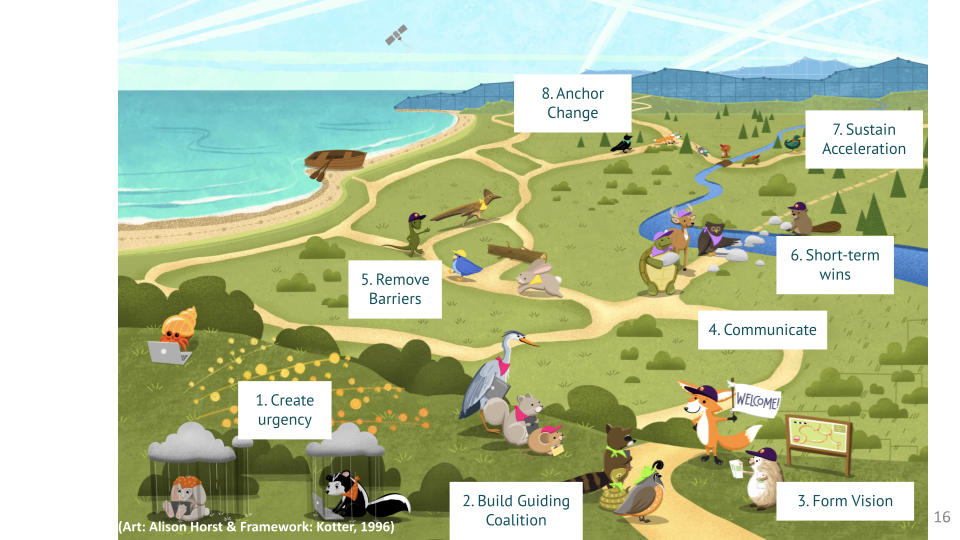
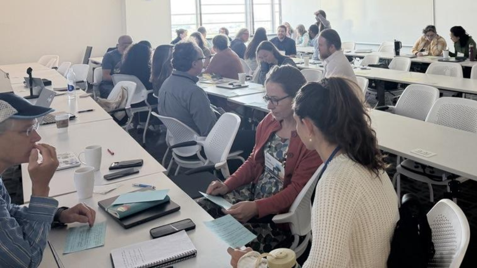

*This is a short post about the Hackday we held at NASA User Working Group
(UWG) Summit, on the heels of the Hackday we led at the 2026 July Meeting! We
were able to reuse our planning and coordinating process and infrastructure,
but adapt for a different audience (scientists and support staff from all of
the NASA Earthdata DAACs), goals, and time constraints. The goal here was to
gather anyone who’s attending the UWG Summit or from on-site at Goddard, and
hack on “contributing to open science to make things easier for scientists”
from policy, social and technical perspectives.*

*Quicklinks:*

- [ESIP Hackday blog post](https://openscapes.org/blog/2026-09-02-esip-hacking-on-ideas/) 
- [Getting to yes slides on zenodo](https://zenodo.org/me/requests/596f3b2f-73ac-468e-9443-8a96f74a1554#record)  
- [ESIP Highlight Slide](https://docs.google.com/presentation/d/13ZAFIAgly2yDH5I7md-STQv2PXSJepBzkRnZu8Gs16g/edit?pli=1&slide=id.g3f6a2cd3f22_2_5#slide=id.g3f6a2cd3f22_2_5)

*Cross-posted at [openscapes.org/blog](https://openscapes.org/blog), [nasa-openscapes.github.io/news](https://nasa-openscapes.github.io/news), [nmfs-openscapes.github.io/blog](https://nmfs-openscapes.github.io/blog)*

------------------------------------------------------------------------

# **Making Change: What We Learned at the ESIP Session "Bridging Divides and Getting to Yes"**

A vast majority of the work that Openscapes supports is about making change.
NASA and NOAA mentors work on big changes like federal agencies moving all
their data to the cloud, and many individuals work on smaller changes like
making a process a bit more reproducible for future you and future us. However,
change can seem like a mysterious process. At the July ESIP meeting, in a
session entitled ‘Bridging Divides and Getting to Yes’, we broke change down
into bite-sized steps using the [Leading
Change](https://www.kotterinc.com/methodology/8-steps/) framework (Kotter,
1996). Kotter identified eight steps to make change:

1. Creating or identifying the urgency  
2. Building a guiding coalition (collaborators to work together, leaders in your network)  
3. Forming a vision and  
4. Communicating that vision  
5. Removing barriers  
6. Identifying small or short-term wins  
7. Building momentum around the change  
8. Finally, anchoring the change in the organization

::: {style=""}
{fig-alt="Figure 1: Our Openscapes landscape with the change framework overlaid" fig-align="center" width="70%"}
:::

While these are presented linearly, as we heard in the session and have all
experienced, we move back and forth through them.

## **Four Vignettes on the “Messy Middle” of Change**

To explore the framework, we heard four vignettes about the path to change from
Eli Holmes (NOAA), Michele Thornton (NASA), Mike Liddel (NOAA), and Julie
Lowndes (Openscapes). The speakers were asked to share just a snippet of the
change and specifically to highlight the parts where it had been messy or
difficult. Between them, the stories touched four common areas of change: tools
and technology, people and relationships, resources and funding, and culture
and policy.

Eli Holmes, NOAA Fisheries Open Science Lead, described getting GitHub
Enterprise adopted across NOAA Fisheries, a tools change that turned out to be
a culture and policy change. Her team formed a coalition and spent four months
writing a vision even though they half-believed it might never come to
fruition. GitHub Enterprise required permission. There was a bright spot: a
science center that already had GitHub Enterprise, but when Eli pointed to it,
the response was no because it was not on the approved list. How do you get it
on the list? IT did not know. Eli continued to investigate how to get on the
list and found out that the person who could actually decide was not someone
she could email directly. However, during a chance meeting, Eli found herself
on a call with that person. While she couldn't email this person, she could
speak up. At the end of the call, she said: "Hey, I have an unrelated
question." That question unlocked everything. It took vision, persistence,
being in the right room, and the courage to ask to add GitHub Enterprise to the
approved list. (Eli's slides from the January 2025 ESIP meeting: [The GitHub
Story at NOAA
Fisheries](https://openscapes.org/blog/2025-01-30-esip-winter-2025/))

Michele Thornton, ORNL DAAC Manager, opened with a familiar slog: enormous
amounts of downloaded data instead moving into cloud-native solutions, and the
thought “there has to be a better way”. A conversation with the right person
surfaced an approach for cloud-native publication, and then her excitement met
resistance. The solution didn't come from winning the argument; it came from
relationships: getting the right people in the room with each other and by
imparting the right technical vision, the needed collaborations were built to
execute the solution together. Because that workflow existed, her team could
publish and analyze data in near real-time during the 2024 LA fires. That's the
payoff of a change made before the urgency arrives. Michele is the one who
named the session's shadow title: sometimes getting to yes is not accepting no.

Mike Liddel, Acting Assistant Chief Data Officer for NOAA Fisheries, told a
story of one change laying the foundation for the next. Starting an Open
Science Community of Practice at NOAA several years ago took vision and real
effort, building a coalition of the eager (an important distinction from the
willing) around open, collaborative work. He anchored this community in the
organization. So when a new directive to move to the cloud came with no
additional time or money, supplying the urgency required for change, the
community was ready. The coalition of the eager could support many more in the
migration to the cloud.

Julie Lowndes, Openscapes Founder and Director, brought the
resources-and-funding story about making the change to become a small business.
In the early days of Openscapes, she was working full-time but paid half-time
to stretch the support at the university. However, the university couldn't
accept payments in the configurations federal teams needed, which meant teams
of feds and contractors who wanted to participate together could not do so.
Universities can also be slow to vendor outside organizations. This did not
align with Openscapes' values of wanting to pay people quickly and easily for
their work. Julie decided to become a small-business owner to overcome those
procurement challenges. It let her accept two payments so whole teams could
join, and it made payments faster. The path to business owner has not been
easy, and sometimes it is very lonely. From this, she offered the approach she
reaches for when change gets hard: Pause (take a beat), Fork (what have you
seen before? who has attempted this?), and Do — ask for help. You don't have to
do it alone.

## **The Interactive Change Lab**

Listening to these stories, it's easy to see the framework shine through. We
know that we learn by doing, and we wanted to activate this learning in real
time. We took an experimental approach that Erin Robinson designed and called
the Interactive Change Lab. The confines of the 30-minute lab provided the
urgency that normally kicks off a change cycle. As participants arrived at the
start of the session, we used the attendance list in the ESIP agenda doc as a
first step to prompt them to consider a change they wanted to make. The changes
the participants named fell into the same buckets as the vignettes (tools,
people, resources, culture) and ranged from federal data infrastructure to
giving yourself permission to pivot careers. 

The lab started with each person receiving a blank 5x8 notecard and writing
down a change they wanted to make. It turned out it was shockingly hard to
write down a change you want to make on the spot, even for the facilitators.
That act of writing on the notecard alone was clarifying. We then passed the
cards around, shuffled, and responded to four prompts, one per round:

1. Build the coalition: Who could help, champion, or unblock this?  
2. Communicate the vision: What would make someone say yes to this?  
3. Remove barriers: What are the objections? Suggest a counter.  
4. Generate a short-term win: What's a near-term action? What could make it
   smaller or faster? What's the 15% version?

After each prompt, we shuffled again, so every card collected input from four
different people who had no idea whose problem they were holding. 

At the end, cards returned to their owners, and we ran a quick 1-4-All
(modified [Liberating Structure](https://www.liberatingstructures.com/1-2-4-all)) 
to digest the input. By and large, there was something useful on every card,
and people were genuinely surprised how valuable anonymous feedback from someone 
outside their context turned out to be.

::: {style=""}
{fig-alt="Figure 2. Folks discussing the input on their cards" fig-align="center" width="70%"}
:::

## **Strategies We Synthesized**

At the close, we harvested strategies from the cards and the room onto the
whiteboard:

- Write it down. Naming the change is harder and more clarifying than it sounds.  
- Reframe the problem. Many people said the most valuable thing they received was a reframe. Refine and test how you define the problem. Ask: what is this problem like, and how has that been solved before?  
- Surround yourself with a smart, diverse team, and do the work of translating the technical problem so they can help.  
- Get to the small yes. Find one person to say yes, then let momentum (and a little FOMO) work on the rest.  
- Make the case in their terms. Show how the change benefits the person saying yes and their organization: metrics, demos, the 15% version they can see working.  
- Look at lots of solutions before narrowing down.  
- Take a step. Any step. And sometimes, take a step back and evaluate where you are.

## **Make Your Own Change** 

This **Interactive Change Lab** format is completely reusable for a team
meeting, a working group, or even just yourself:

1. Write down a change you want to make. (Expect this to be hard.)  
2. Answer the four prompts (coalition, vision, barriers, short-term win) yourself, or better, hand your card to people who don't know your context.  
3. Ask "why now?" If you can't answer it, that might be the first thing to work on.  
4. And as Julie said: Pause, fork, do: take a beat, look for who has done something like this before, and then act: this is often asking for help.

Beyond this short activity, the [Openscapes’ Approach
Guide](https://openscapes.github.io/approach-guide/) has many resources that
your group might find helpful to make change. The Openscapes Champions
[pathways template](https://openscapes.github.io/series/pathways.html) (drawn
from Lowndes et al., 2017\) is an excellent resource for mapping out the vision
and steps for your change and collaborating on them with your team. The
[Reflections program](https://openscapes.github.io/approach-guide/reflections/)
also provides a quick three-week scaffold to kick-start change. 

Good ideas don't become reality on their own. But as our four speakers and
dozens of notecards showed us, coalitions can be built before you need them,
and a no is often the easiest first position. And sometimes getting to yes
means persistently not taking no. 

Finally, thank you to our speakers — Eli Holmes, Michele Thornton, Mike Liddel,
and Julie Lowndes — for sharing the messy middle of making change, and to
everyone in the room (and online) who brought real changes to the table and
generous feedback to each other's cards. Thank you Erin Robinson for designing
and leading the session, the Interactive Change Lab was so valuable and we’re
excited to see where people reuse it. This session only worked because of
everyone’s contributions. Thank you!

