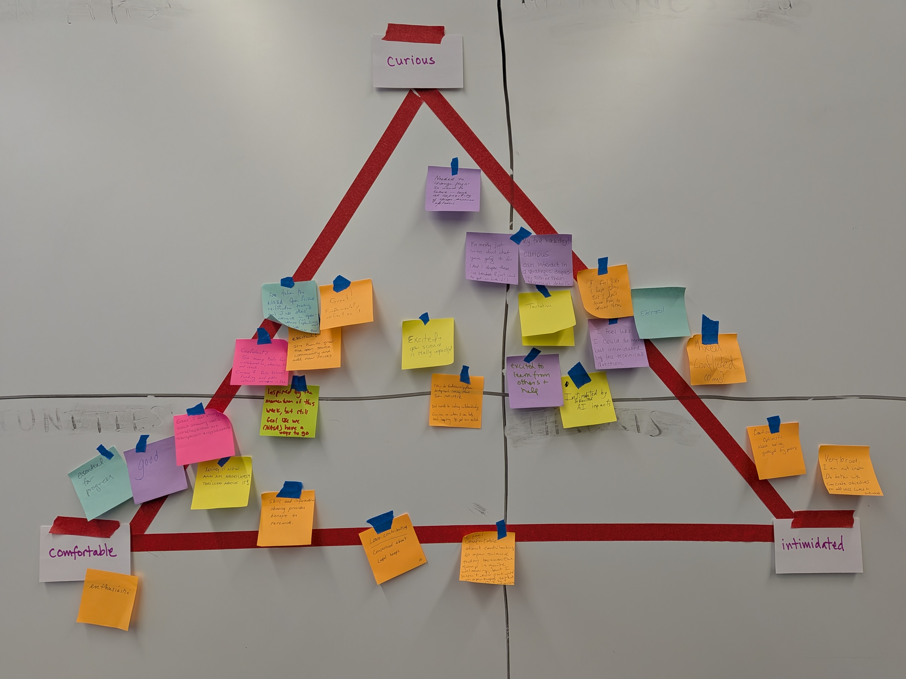

*This is a short post about the Hackday we held at NASA User Working Group
(UWG) Summit, on the heels of the Hackday we led at the 2026 July Meeting! We
were able to reuse our planning and coordinating process and infrastructure,
but adapt for a different audience (scientists and support staff from all of
the NASA Earthdata DAACs), goals, and time constraints. The goal here was to
gather anyone who’s attending the UWG Summit or from on-site at Goddard, and
hack on “contributing to open science to make things easier for scientists”
from policy, social and technical perspectives.*

*Quicklinks:*

- ESIP Hackday: [https://openscapes.org/blog/2026-09-02-esip-hacking-on-ideas/](https://openscapes.org/blog/2026-09-02-esip-hacking-on-ideas/)

*Cross-posted at [https://openscapes.org/blog](https://openscapes.org/blog/2026-09-04_uwg_openscapes_hackday/), [https://nasa-openscapes.github.io/news](https://nasa-openscapes.github.io/news/2026-09-04_uwg_openscapes_hackday), and [https://nmfs-openscapes.github.io/blog](https://nmfs-openscapes.github.io/blog/2026-09-04_uwg_openscapes_hackday)*

------------------------------------------------------------------------

::: blockquote-blue
> *“Thank you for putting together that experience for us, and for everything you are doing for our community.”* - Adrian Borsa, Faculty at UC San Diego and ASF UWG Member.
:::

The NASA Openscapes Mentors led a Hackday on Aug 20 2026 on the final day of
the NASA User Working Group (UWG) Summit at the NASA Goddard Space Flight
Center in Greenbelt, Maryland. The theme was  “Contributing to open science to
make things easier for scientists”.  **“Hackday”** to our NASA Openscapes and
earthaccess communities means we will be collaboratively problem-solving and
strategizing, and translating ideas into action. This includes decisions, code,
and documentation. The Hackday was led in person by Amy Steiker (NSIDC), Danny
Kaufman (ASDC), and Julie Lowndes (Openscapes). It was produced additionally by
Andy Barrett, Stef Butland, and Ronny Hernandez Mora.  

**What we did:** We had a short welcome about the plan
([slides](https://docs.google.com/presentation/d/1IoTI_Jfqv9FQPeRePnNICUzwOuDXw-9yVoxb1R6C8Yw/edit?slide=id.g3a27e6ef73f_0_1789#slide=id.g3a27e6ef73f_0_1789)),
and an icebreaker where everyone put sticky notes on the wall to get a sense of
“how are you feeling about contributing to open science today”: comfortable,
curious, intimidated. Amy Steiker led a great Showcase of earthaccess: how to
use and contribute. Her code demo produced an error – something that would
benefit by an improved error message. Folks were engaged – before Amy could
even do the second part of the planned demo "let's make a github issue together
to suggest this improvement", the audience was suggesting fixes from their
experiences. This demo and energy then translated well for the breakout
sessions: people chose between 3 topics to spend 1 hour before lunch and
additional time as flights allowed. Topics are listed here, along with links to
what each group accomplished – links to their contributions to open science: 

* **Contribute as a newer user** \- Amy Steiker  
  * [DOI search error was confusing](https://github.com/earthaccess-dev/earthaccess/issues/1429)	  
  * [GRACE/FO data temporal choice incorrect](https://github.com/earthaccess-dev/earthaccess/issues/1436)  
  * [Search results representation is very hard to read](https://github.com/earthaccess-dev/earthaccess/issues/1435)  
  * [Show a message/explanation when no data is found](https://github.com/earthaccess-dev/earthaccess/issues/1434)  
  * [Add Copy Buttons To Quickstart](https://github.com/earthaccess-dev/earthaccess/discussions/1431)  
* **Contribute as a more seasoned user** \- Danny Kaufman  
  * [Tutorial credential issue](https://github.com/earthaccess-dev/earthaccess/issues/1430)  
  * Discussing [GitHub Actions test suites to triage and evaluate AI contributions](https://github.com/earthaccess-dev/earthaccess/pull/1419)  
  * Discussion about [Windows testing](https://github.com/earthaccess-dev/earthaccess/discussions/1432)   
* **Contribute to open source ecosystem** **(not earthaccess specific)** \- Julie Lowndes  
  * [Please add installation info on earthaccess home page](https://github.com/earthaccess-dev/earthaccess/issues/1439)   
  * We worked in a sandbox [repo](https://github.com/NASA-Openscapes/2026-uwg-summit-hackday) and used the [GitHub Clinic](https://openscapes.github.io/series/core-lessons/github/) to learn commits, markdown, and creating a website with gh-pages. ([Walt](https://github.com/NASA-Openscapes/2026-uwg-summit-hackday/blob/main/github-clinic/walt.md), [Lisa](https://github.com/NASA-Openscapes/2026-uwg-summit-hackday/blob/main/github-clinic/lisa.md))  
  * Then we practiced pull requests and forking a [Quarto book tutorial](https://openscapes.github.io/quarto-website-tutorial/) to contribute to open science documentation ([Walt](https://waltmeier.github.io/quarto-website-tutorial/), [Lisa](https://wxaggie01.github.io/quarto-website-tutorial/))

::: {style="text-align:center;"}
{fig-alt='A whiteboard with red tape forming a triangle labeled “Curious” at the top, “Comfortable” at the lower left, and “Intimidated” at the lower right. Participants placed multicolored sticky notes across the triangle to indicate their feelings and reflections.' fig-align="center" width="60%"}
:::

There is such value in hackdays / hackweeks / co-creation time in general! We
are thrilled with how much people accomplished, and how eager they were to
contribute when welcomed and supported to take their next steps. We were able
to lead this together with light planning because we are comfortable and have
open and synchronous/asynchronous systems of working together, and this kind of
ongoing investment in teams is important to make them happen.

