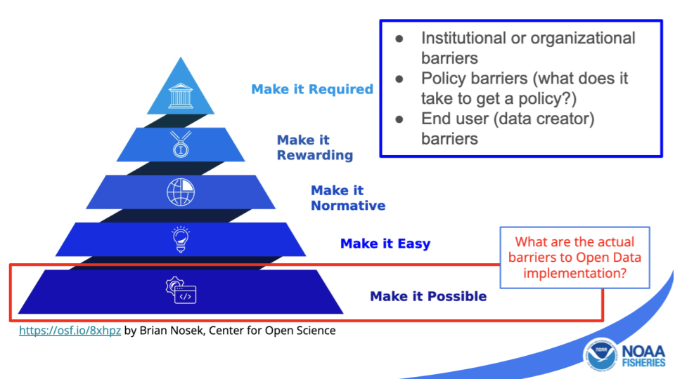
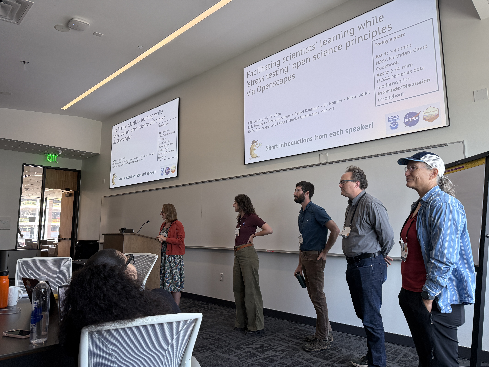
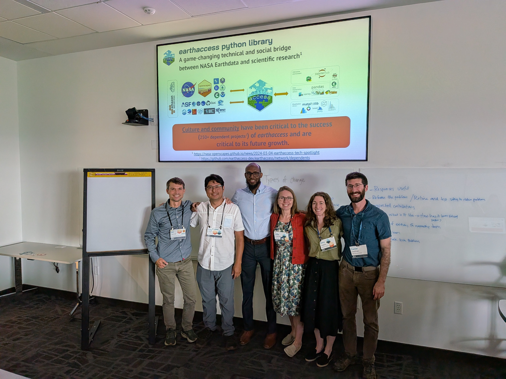

*Openscapes participates in ESIP (Earth Science Information Partners) meetings
every year, and looks forward to the hybrid (in-person and virtual) meeting in
July that brings together information technology professionals, teachers, and
researchers to discuss about Earth science data, computing, and technology. The
2026 July Meeting was in the beautiful city of Austin, Texas (keep it weird!)
from July 28 to 31, with an extra day for an Openscapes Hackday on July 27.*

*Through all the ESIP sessions, a couple of questions kept resurfacing: what
will happen to the many tools, datasets, and products as AI changes how people
interact, discover, and use scientific information? How can they work together
across platforms, organizations, and people? And, probably most importantly,
how can we support and sustain the people who will maintain the open
infrastructure that makes all this possible? This is about the people, the
organizations, and the conditions needed for open science practices to grow:
from making a new idea possible to gaining institutional support to build the
tools and products that can be sustained and adapted through time. This post
focuses on the sessions and talks that the NASA and NOAA Openscapes Mentors led
on Wednesday.*

*Quicklinks:*

- *ESIP Highlights webinar ([slides](https://zenodo.org/records/22099706), [recording](https://www.youtube.com/watch?v=5cbM78GVufM)) \- 2-min summaries from each session, organized by the ESIP team*  
- *2026 Sched. We led four sessions:*   
  - [*Openscapes hackday*](https://2026julyesipmeeting.sched.com/event/2PWWU/openscapes-hackday?linkback=grid)  
  - [*Facilitating scientists’ learning while 'stress testing' open science principles via Openscapes*](https://2026julyesipmeeting.sched.com/event/2OZt1/facilitating-scientists-learning-while-stress-testing-open-science-principles-via-openscapes?linkback=grid)  
  - [*Bridging divides and getting to yes*](https://2026julyesipmeeting.sched.com/event/2OZtH/bridging-divides-and-getting-to-yes?linkback=grid)  
  - [*earthaccess: five years of open source science leadership at NASA*](https://2026julyesipmeeting.sched.com/event/2OZtQ/earthaccess-five-years-of-open-source-science-leadership-at-nasa?linkback=grid)  
- [*Getting to Yes blog post*](https://openscapes.org/blog/2026-09-03-getting_to_yes/)  
- [*Hackday blog post*](https://openscapes.org/blog/2026-09-02-esip-hacking-on-ideas/)

*Cross-posted at [nasa-openscapes.github.io/news](https://nasa-openscapes.github.io/news.html), [nmfs-openscapes.github.io/blog](https://nmfs-openscapes.github.io/blog.html) and [openscapes.org/blog](https://openscapes.org/blog).*

------------------------------------------------------------------------

## **“How was ESIP?”**

When Ronny, Ileana, and Julie returned from ESIP, here were our overall summaries:. 

**Ronny**: This was my first time attending a meeting centered on creating
scientific tools and data products, and also the first time I had seen so many
people openly share their questions, uncertainties, ideas, and opportunities
for collaboration. Attending the meeting was also my opportunity to finally
meet Ileana, Julie, and many of the NASA and NOAA colleagues I had previously
known only through the world of video calls\! I enjoyed hearing different
perspectives on AI and considering how it might interact with the tools people
use to discover, access, and analyze Earth science data. The meeting left me
thinking about how much work lies behind every tool and data product—not only
technical development, but also metadata, documentation, governance,
maintenance, and the relationships that make collaboration possible. I left
feeling curious, excited to keep learning, and thinking in ways I can
contribute to the efforts!

**Ileana**: As a first time ESIP Summer Meeting attendee I came back excited to
talk about just how different being at ESIP felt. As an academic researcher by
training, conferences I have attended often bring about blank stares and tired
eyes from watching presentation after presentation all day long. At ESIP, the
interactive and engaging format of sessions, often inviting breakout groups and
audience engagement, was a welcome and fun shakeup that left me rallying to fit
as many sessions and conversations as possible into each day\! What struck me
the most was that ESIP has created such a dynamic and engaged community of
participants that it felt like a welcome with open arms to a newcomer like
myself. In addition to this warm welcome, I observed and felt an invitation to
dream big. There was this incredible energy of collaboration and community
amongst participants that felt like a breath of fresh air as I am dreaming of
what to do next. I walked away feeling inspired, connected, and with my
calendar already marked for next year\!  

**Julie**: The ESIP July Meeting is such a treat every year, a chance to see in
person many people I work with on a weekly basis but always from Zoom, as well
as to meet new people and folks that I only have the chance to connect with
once a year. My goals this year – in addition to co-leading three official
sessions plus the Monday Hackday and Social Hour – was to spend time with
people. From the Openscapes Core Team, I met Ronny for the first time, and saw
Ileana for the first time since we were [recognized for the Year of Open
Science](https://openscapes.org/blog/2024-10-03-openscapes-recognized-white-house/index.html).
I liked dancing two-step with colleague-friends at an old-school honky tonk\!
I liked helping connect every combination of NASA and NOAA Mentors and
Leadership and other ESIPers – and I tried to share specific things about why
it was good for them to meet each other so that they could quickly find common
interest. I have been thinking a lot about “forkable stories” – being able to
copy-modify and take action based on what you’ve heard someone else do. ESIP
helps make that possible. 

Together, we hosted a Monday Hackday with the NASA Openscapes Mentors (see blog
post: “[Finding Solutions Faster by Hacking on Ideas with Openscapes at
ESIP](https://openscapes.org/blog/2026-09-02-esip-hacking-on-ideas/)”) attended
sessions throughout the week, and joined social dinners, walks to see bat
roosts along the river, went two-stepping, and prepared posters for ESIP
FUNding Friday – and Ileana’s pitch won, see below\! 

## **Sessions emphasizing social and technical work across government agencies** 

On Wednesday, NASA and NOAA Openscapes mentors presented in every time-slot,
including three sessions we co-convened with NASA and NOAA Openscapes mentors.
Across the sessions, one message connected the technical and social
discussions: better tools and data formats matter, but their adoption depends
on people having the support, trust, and opportunities needed to use and
sustain them.

### [Closing the ARCO Adoption Gap: Modernizing Data Analysis Workflows](https://2026julyesipmeeting.sched.com/event/2OZsm/closing-the-arco-adoption-gap-modernizing-data-analysis-workflows?linkback=grid)

One of the topics nowadays is about workflows in the cloud. Many datasets have
been adapted or created as Analysis-Ready, Cloud-Optimized (ARCO) data. This
session focused on how to support people shifting from workflows that download
and analyze data locally to cloud optimized workflows. 

Eli Holmes (NOAA Fisheries) presented [Beautiful, Barrier-Free Visualization as
an Incentive for ARCO
Adoption](https://docs.google.com/presentation/d/1M1T6CKbQo5vujBy-DMQNadPSAqptqc2LZ2Zn4SaB2tY/edit?slide=id.p#slide=id.p).
The main idea is that showing people useful tools that are easy to use and
adapt can accelerate adoption. Eli showcased an [interactive
visualization](https://eeholmes.github.io/gridlook-xl/#::varname=10u::dimIndices_time=0)
created with [Gridlook](https://gridlook.pages.dev/) to easily visualize data
hosted as Zarr (including Icechunk) taking advantage of GitHub pages. With an
[open
dataset](https://data.source.coop/bkr/metoffice/metoffice_global_deterministic_10km.icechunk),
and a few lines of code on
[GitHub](https://github.com/eeholmes/gridlook-xl/blob/main/.github/workflows/deploy-pages.yml)
Actions, users can publish visualizations of their own or others’ compatible
datasets.

Luis Lopez (NSIDC) presented [From Files to Analysis: Chunking, Virtualization,
and ARCO-like Access Patterns in the
Cloud](https://docs.google.com/presentation/d/18dj3D1vZJwiDjjXtyie6WG9JsfutpwCZx9BqnBd8-gg/edit?slide=id.g3f975384e97_2_148#slide=id.g3f975384e97_2_148),
sharing the evolution of archiving data, legacy constraints that dictates the
shape of the units of storage, and the evolving landscape of tools. Part of the
effort to adopt Modern ARCO-like workflows requires that we fix our data to
make it behave like cloud optimized formats even if it’s not. Both Luis and Eli
also presented in the 2-part [Virtual Stores
Sessions](https://2026julyesipmeeting.sched.com/event/2OZsM/virtual-stores-bridging-archival-formats-with-cloud-native-access-part-1)
convened by Aimee Barciauskas (Development Seed).

::: {style="text-align:center;"}
{fig-alt="Left-to-right workflow showing fragmented NetCDF, HDF5, and GRIB files progressing through DGGS, Zarr, VirtualiZarr, Icechunk, STAC and earthaccess, and zarr-datafusion. These technologies provide spatially consistent grids, cloud-native chunking, zero-copy access, versioning, data discovery, and efficient querying, culminating in AI-ready data cubes that require minimal preprocessing." fig-align="center" width="60%"}
:::

### [**Facilitating Scientists' Learning While Stress Testing Open Science Principles via Openscapes**](https://2026julyesipmeeting.sched.com/event/2OZt1/facilitating-scientists-learning-while-stress-testing-open-science-principles-via-openscapes?linkback=grid)

For this session we had the NASA Openscapes and NOAA Fisheries Openscapes
Mentors Alexis Hunzinger (GES DISC), Daniel Kaufman (ASDC), Eli Holmes (NOAA
Fisheries), and Mike Liddel (NOAA Fisheries) shared stories and observations
([slides](https://docs.google.com/presentation/d/1eGe2gRTeQjnWShkesSuj5FI3Gdi4urHVW6vPtyV8mDw/edit?usp=sharing))
about the process they have been going through to make progress on open science
activities within the requirements of government agencies. Themes included the
need to make space for collaboration. The journey to enable this has many
nuances, and is not always a straight path forward. 

::: {style="text-align:center;"}
{fig-alt="Diagram titled “Openscapes approach—stabilizing infrastructure.” Tooling and people are connected by two-way blue arrows encircling trust, while innovation and maintenance are connected by two-way orange arrows, creating two overlapping and mutually reinforcing feedback loops." fig-align="center" width="60%"}
:::

Some of the key takeaways from these stories are that the tooling around open
science is also social. You need to involve people in the loop. And you can
involve people when there is trust. "Open Science runs on trust". Danny
discussed how you have to make “space for serendipity”. Alexis described how
there is trust and hesitation underlying the various URLs where NASA Earthdata
tutorials have been available, and how this is a consideration going forward
for the Cookbook. Eli shared about a listening session where they found that
“making it possible” is still a big focus for folks, and relies on trust. Mike
shared about including IT from the beginning on successful projects, since they
are often experienced with open source work but can also be surprised by the
open science outputs that researchers create. One key message is that learning
does not happen in a vacuum\! which means that there are prerequisites such as
staff time, tools and infrastructure, IT support, leadership and student
buy-in. 

::: {style="text-align:center;"}
{fig-alt="Five-level pyramid showing the progression of open-data adoption: make it possible, make it easy, make it normative, make it rewarding, and make it required. The highlighted base asks about barriers to implementation, including institutional or organizational, policy, and end-user barriers." fig-align="center" width="60%"}
:::

The session reflected on how progress is possible because there is a loop on
which trust is involved: trust in the people, trust in the time allocated,
trust in the outputs produced, trust in the process and interactions that can
happen here (sometimes is not planned and is serendipity!) This progression
matters because simply requiring a new practice does not guarantee meaningful
adoption. People first need the time, support, and opportunity to use it
successfully.

::: {style="text-align:center;"}
{fig-alt="Presenters standing at the front of a conference room. Behind them, projected slides introduce a session on facilitating scientists’ learning while stress-testing open-science principles through Openscapes." fig-align="center" width="60%"}
:::

### [**Bridging Divides and Getting to Yes**](https://2026julyesipmeeting.sched.com/event/2OZtH/bridging-divides-and-getting-to-yes?linkback=grid)

We asked Erin Robinson to develop and lead this session, and she also authored
a summary blog post: [Making Change: What We Learned at the ESIP Session
“Bridging Divides and Getting to
Yes”](https://openscapes.org/blog/2026-09-03-getting_to_yes/). Speakers Michele
Thornton, Eli Holmes, Michael Liddel, Julia Lowndes shared short stories of
what it looked like to “get to yes”
([slides](https://docs.google.com/presentation/d/1_IJYoaYZZ1AbqfJEjVmwIna_i-QEnuK7FlkywSm5mlc/edit?usp=sharing))
regarding moving ideas forward. 

A common pattern emerged: receiving a “no” did not necessarily mean that the
idea had reached its end. Instead, it created an opportunity to step back and
ask what was preventing others from saying yes. Was the request reaching the
right person? Were the benefits clear? Did the proposal respond to the needs of
the people who would use the tool, process, or data? Were concerns about time,
resources, risk, or responsibility still unresolved? Getting to “yes,”
therefore, was not simply about making the same request more forcefully. It
involved understanding other perspectives, identifying the people whose support
was needed, and reframing or adjusting the proposal so that its value became
clearer. Sometimes the path forward was a smaller and more concrete request:
permission to test an idea, time to develop a pilot, access to IT support, or
an introduction to a potential collaborator.

### [**earthaccess: Five Years of Open Source Science Leadership at NASA**](https://2026julyesipmeeting.sched.com/event/2OZtQ/earthaccess-five-years-of-open-source-science-leadership-at-nasa?linkback=grid)

Earthaccess is not only a python library – is a powerful model for open-source
tool sustainability and user-driven development. It is now widely used not only
because it solves real user problems, but because it has been intentionally
developed openly and amplified via storytelling. This session was a celebration
of 5 years of open science leadership. We shared several short stories: What is
earthaccess and current impact; Why is this so widely known?; How we work: open
governance**;** Current focus: virtualizing, AI-preparation; and Untold
enabling stories. earthaccess was born out of the necessity to simplify the
process of accessing the data by reducing the need to deal with different
workflows, data centers, cloud object storage, credentials and so on. This
session was also followup from our 2025 ESIP FUNding Friday award.
[Slides](https://docs.google.com/presentation/d/1zZv_Q8vGeZVNJ9xarnQveZwgvBcB39hyyW2-bE2jl0c/edit?usp=sharing)
were presented by Ian Carroll, Amy Steiker, Danny Kaufman, Luis López, Joseph
Kennedy, Julie Lowndes, Justin Rice.

::: {style="text-align:center;"}
{fig-alt="pose together beneath a slide describing the earthaccess Python library as a technical and social bridge between NASA Earthdata and scientific research. pose together beneath a slide describing the earthaccess Python library as a technical and social bridge between NASA Earthdata and scientific research." fig-align="center" width="60%"}
:::

The future for `earthaccess v1.0` is expanding toward virtual data sources that
allow people to work with cloud-hosted data through tools such as xarray
without first copying entire datasets. Its roadmap toward version 1.0 includes
a stable API, performance improvements, virtual data stores, STAC
interoperability, and a plugin architecture. Together, these developments show
that open-source science leadership involves more than creating useful
software: it requires sustained outreach, shared governance, and continued
adaptation to emerging scientific needs.

Since ESIP, Andy Barrett also gave a live demo about earthaccess during an
Earthdata Webinar short: [Using the earthaccess Python Library to Stream
Data](https://www.earthdata.nasa.gov/events/using-earthaccess-python-library-stream-data)\!

## **Making plans for next steps after ESIP**

**On Thursday afternoon at ESIP, there was unconf time:** open time during the
event to discuss or work on something that has come up during the meeting. This
year, we pitched and then used this time to vision the Openscapes Mentor
community going forward at NASA Earthdata. There is an upcoming NASA Townhall
this Fall where we will learn more about NASA’s plans, stay tuned as we learn
more\!

**Winning ESIP FUNding Friday\!** This year our team member Ileana Fenwick won
ESIP’s FUNding Friday mini-grant for $5,000 with a proposal entitled “Two
stepping into student data fun\!” Ileana says: we aim for this funding to
support exploring how novice users approach and use for the first time open
access tools and resources. A highlight of the trip was watching the idea move
from a series of Slack messages to a collaborative pitch from conversation and
discussion around the concept of new user experiences. Specifically, we are
collaborating with earthaccess developers to test with university students,
with a path for feeding the feedback directly to their team. ESIP really does
know how to put the FUN in FUNding, because in this mini-grant competition the
encouragement to collaborate creates a fun evening of conversation, idea
iteration, and of course illustration (and for us two-stepping\!) for the
competition poster. We are looking forward to ESIP’s Summer Meeting in 2027 to
report out\! 

**One thought stayed with us after the meeting: no matter how much data we
collect or how sophisticated our tools become, people remain at the center.**
It is people who use these resources to make decisions, understand our world,
adapt to change, and improve quality of life. It is people who connect the
data, technologies, and ideas, that progress depends on our ability to
communicate, build trust, create spaces for collaboration, and learn from and
teach one another. To the question, How will people using AI interact with
Earth science data products? There is no single answer, but several pieces need
to come together to prevent data from becoming invisible for AI tools.
Technology will continue to change, but working together is how we will move
forward. 

