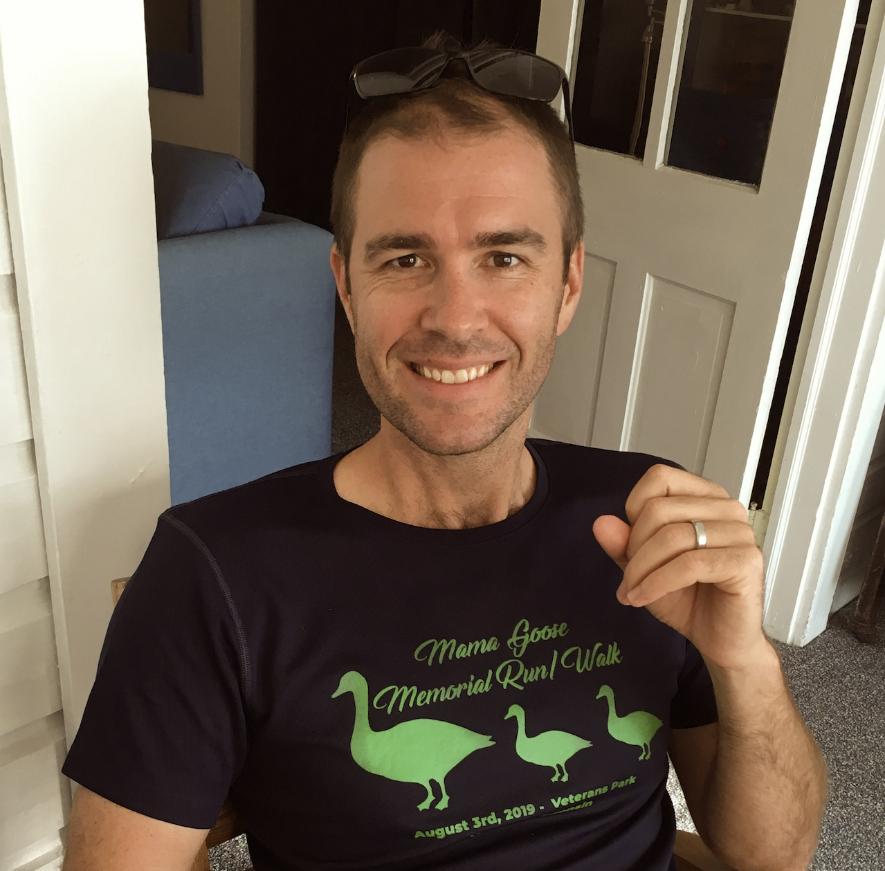
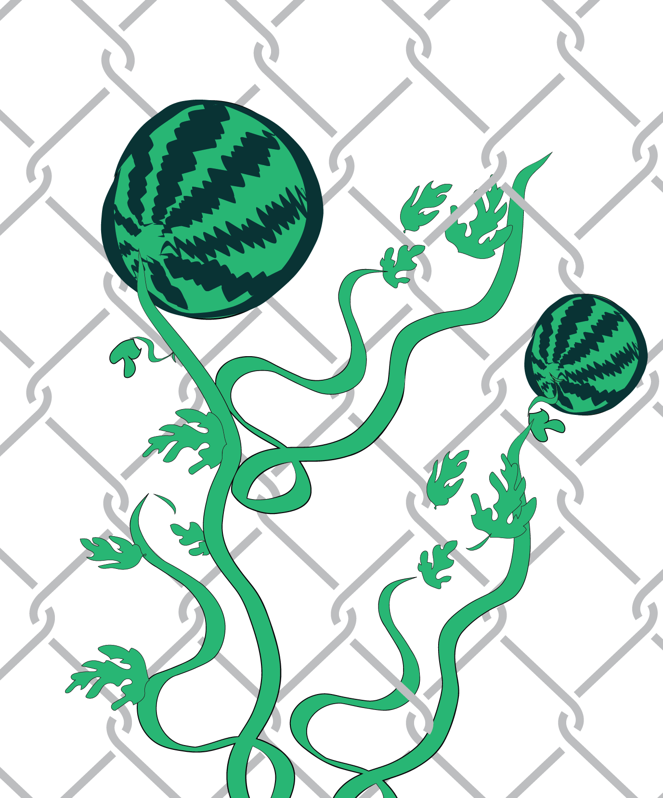
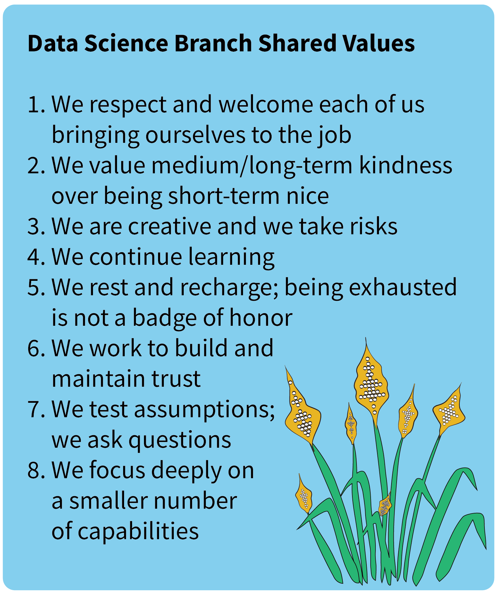

_I wrote this in December 2022, in my last weeks at the U.S. Geological Survey
after ten years there, most of them spent building the water data science
capability that became a branch in the Water Mission Area. It was written for
whoever took the job next, and for anyone else trying to grow a technical team
inside a large federal organization._

_I'm now CEO of CUAHSI, a university consortium that supports water science with
shared data infrastructure, training, and convening. Different setting, but I'm
still focused on creating the conditions for other people to do great water
science work together._

_A few notes for 2026: The post describes the branch as existed in 2022, and a
lot has changed at USGS since, so read it as a record rather than a current
description. Some of the links point to pages that have moved or been retired,
and I've noted those where they appear. The shared values in Box 1 were written
by the whole group back in 2022 and are still useful to look back on._

*Cross-posted at [nasa-openscapes.github.io/news](https://nasa-openscapes.github.io/news.html), [nmfs-openscapes.github.io/blog](https://nmfs-openscapes.github.io/blog.html) and [openscapes.org/blog](https://openscapes.org/blog).*

------------------------------------------------------------------------

## Turning over a new leaf {#new-leaf}

::: {style="text-align:center;"}
{fig-alt="An image of an imaginary dandelion-like plant spreading it's seeds of knowledge out with a lone oak seedling growing determinately up from the ground." fig-align="center"}
:::

*Every oak tree started out as a couple of nuts who stood their ground.*
*– Henry David Thoreau*

Thanks to [Althea](https://www.usgs.gov/staff-profiles/althea-a-archer) for
helping put together this post! Credit to her for coming up with framework for
the post and providing editorial guidance, and for her and
[Cee](https://www.usgs.gov/staff-profiles/cee-nell) for designing all of the
images that appear here.

::: {style="text-align:center;"}
{fig-alt="An image of Jordan S Read smiling at the camera." fig-align="center" width="40%"}
:::

------------------------------------------------------------------------

I can't imagine a more satisfying end to my decade of federal service, most of
which I spent growing data science capabilities. I've been a major part of
bringing dozens of incredibly talented people into the federal workforce. I
worked hard to established a water data science capability that is in high
demand and has inspired the career choices of many. This progress was realized
over many years. In 2012~2013, our first few data scientists joined what at the
time was a software development and analytics team, and we won proposals and
data-intensive project work to grow and hire staff that each brought new ideas
and contributions to our collective vision for data science. We created a
proposal to formalize our ad hoc group as a data science team in 2015 and our
goals were to: 1) provide leadership for the emerging water data science
community, 2) enhance the relevance and usability of water data and water
analysis/modeling software, and 3) expand the community of practicing water
data scientists. As I was organizing files to get ready for my departure, I ran
across the proposal that contained these elements and it was neat to see our
foresight at the time and our follow through in the years after. As of last
year, we'd brought our water data science practice to a level that met these
goals (read more about that
[here](https://waterdata.usgs.gov/blog/water-data-science-2022/); see Figure
1).

I was the supervisory data science team lead that helped us take root in 2015
and then I became the data science branch chief in March of 2017 when the team
was elevated into a formal branch in the USGS water mission area. The job of
federal data science manager has been rewarding and exhausting. There were
never enough hours in the day to keep up with the endless excitement as the
data science discipline expanded and inadequate structures to handle our team's
growth. I had a strong allegiance to staff and our shared mission, while
working hard to lead change in a place that is notoriously high inertia (the
federal government). I was at my best when I focused on cultivating the ideal
conditions for others to flourish. Looking back now, I am deeply proud of where
we are and the role I played in our accomplishments.

I learned a lot in my management roles and hope that others will benefit from
hearing about the journey. Data science management is common enough now that
you can read about it in various places, but the federal data science
perspective is harder to find and I hope to contribute by filling in some
information gaps that may be of use to my replacement or others considering
similar roles.

::: {style="text-align:center;"}
{fig-alt="Image with a large tub collecting data rain that then travels down tubes until it is released on to plants as an irrigating mist. The rain falls on a colletion of flowers and fruit. Intermixed are some pollinating butterflies." fig-align="center" width="60%"}
:::

## Bloom where you're planted {#bloom}

I'd imagine some significant differences exist between growing data science at
a start-up vs in the largest bureaucracy on earth, the US federal government.
The federal identity shapes so much of what we have authority and
responsibility to do that it might help to consider it as a climate zone – you
wouldn't expect drought-adapted plants to flourish in a rain forest and you
shouldn't be surprised when an otherwise amazing idea dies on the vine because
it was outside of scope of your federal agency.

::: {style="text-align:center;"}
{fig-alt="An image that shows a watermelon-like fruit vine climbing a chainlink fence." fig-align="center" width="50%"}
:::

Constraints can be flipped into identity-defining values that staff embrace and
embody. Align the work and the people with the climate zone you are operating
in, add a few of the right seed projects, align appropriate staff, and soon you
can cultivate something that can be sustained. The federal constraints can be
messaged as restrictive or burdensome, or alternatively, can help form a niche
that makes it easier for all of you to define what you do, why you do it, and
where you'll take it next. As illustrated above (Figure 2), a fence could
isolate (negative) or provide a critical substrate for growth (positive).

*Aside: The positive spin is also critical because negative messaging from
leadership builds up over time and can lead to negative group-think that
skewers each new interesting idea with all of the ways it could fail.*

I've got a few of these positive constraint examples below based on my
experience in the U.S. Geological Survey, but I'm sure there are many parallels
elsewhere:

#### Public service motivates leadership in open science

In federal service, we aim to provide value to the nation. This is an exciting
and motivating concept at the USGS because when we share data or code, in most
cases we need to share it with all. In the data science branch, we've taken
this on as a charge to provide more leadership in open science. USGS
researchers already need to provide the data behind federally funded science,
but many of our staff are motivated to take that much further, providing data,
code, preprint publications, data visualizations, and how-to tutorials as part
of releasing new content. Instead of protecting the intellectual property (IP)
of our ideas or methods, our aim is to share IP publicly and support others to
learn or build on it.

#### Employee retention leads us to remote-first work culture

Our original data science team was formed in Madison, WI and all employees
worked together in the same building. In 2016-2017, three employees relocated,
and I retained them by modifying their work agreements (in fed-speak, this was
done by changing the employee's "duty station"). After these moves, we had
shifted into the dreaded hybrid remote/in-person work zone. In hindsight, I was
embarrassingly behind at managing this transition effectively, relying on extra
effort from the remote staff to stay connected and retaining most of our
practices. At about the same time, the negative impact of my Madison-only
hiring practices on reaching more diverse applicants became clear. The
in-person model wasn't cutting it and I shifted my thinking around to
down-weight in-person work and socialization in favor of better recruiting
potential. Cue COVID-19 and suddenly we were 100% remote (or in truth, many of
us 100% teleworking from home) and my hiring approach became remote-first with
a negotiable location anywhere within the US. Like many others, we had to
embrace being fully remote. But we all wanted to make this experience great and
worked together to make major positive changes. I'm really proud that we
embraced this work posture early; we've now had a lot of time to refine and
build new processes. Our constraints for how colleagues would work together
evolved into a vibrant distributed workforce that maintains long distance
friendships and carries out highly effective collaborations.

#### Hiring challenges become recruiting strengths

The intersection of many different policies and requirements contributes to the
impression that federal hiring is very hard. Federal employees also have
protections from being removed without clear and documented cause. Together,
these two things mean federal employees may have higher inertia when compared
with other employment pathways - harder to get in the door and harder to be
shown the door back out. Since the success of our efforts depends on our
ability to attract and hire people to do data science work, getting hiring
right had to be a priority. We completely reimagined hiring and what we came up
with blossomed into a bit of a model for other parts of the organization (see
blog on _data sci/ML hiring_ and _viz hiring_) (*These blog
posts are no longer available*) efforts are covered in
other blogs, I won't say much more about it. But it is neat to reflect that we
took something that many federal managers view as the low point of their work
(navigating the hiring processes) and turned it into something we excel at,
provide leadership for, and have wide ownership of across existing staff.

*Aside: Federal jobs are great and the benefits are super competitive. But in
fast growing data/tech positions, we're often recruiting candidates that have
the potential to earn more elsewhere. To stay competitive, I have found that
sharing our branch's values (see Box 1 below) and workplace culture loudly and
proudly have helped our hiring process become more inclusive and more
compelling.*

::: {style="text-align:center;"}
{fig-alt="A list of our 8 shared values. They include: 1. We respect and welcome each of us bringing ourselves to the job, 2. We value medium/long-term kindness over being short-term nice, 3. We are creative and we take risks, 4. We continue learning, 5. We rest and recharge; being exhausted is not a badge of honor, 6. We work to build and maintain trust, 7. We test assumptions; we ask questions, 8. We focus deeply on a smaller number of capabilities." fig-align="center" width="60%"}
:::

## Gardener's wisdom {#gardener}

My approach to managing data scientists evolved a lot over the ten-year period
(2012-2022) that included generating the vision, formalizing the team, and
later formalizing the data science branch. I have boiled key parts of this
approach down to a list that could be useful for others, perhaps as idea seeds
for current or future data science managers in government (Figure 3). Each of
these concepts proved fruitful for our data science group and I think they are
generally useful for others entering into this line of work.

::: {style="text-align:center;"}
{fig-alt="An illustration of dandelion seeds blowing in the wind from left to right. Bottom of image is wild green grass." fig-align="center" width="60%"}
:::

#### Build authentic relationships with the staff that you represent {#authentic}

- ***Justification:*** Developing empathy for staff you represent is a critical
component to effective supervision. The benefits of putting in the work to
build these connections are staggering and some are obvious, including staff
feeling welcome to be themselves or having more honest conversations about
skill-building needs.
- ***Considerations:*** Supervisors often focus on the business aspects of
staff relationships and avoid making social connections during one-on-one
meetings. But building relationships and working to create a real empathetic
connection to each employee can lead to more inclusive and effective decisions
because the impacts of the outcome on each employee is implicitly considered.
Doing this work requires bandwidth and can be emotionally taxing, but
avoidance may negatively affect performance, morale, and retention of the
team.
- ***Example:*** I worked on building authentic relationships with staff more
purposefully beginning in 2019 and I'm glad I had a head start prior to
COVID-19 because of how critical it was to have empathy for each employee and
what they were going through. By the time our 2021 cluster hire effort began,
I had upskilled this managerial capability and approached hiring decisions by
incorporating team complementarity, which means I took into account
collaborative competencies and likelihood of effective team contributions as
opposed to assessing candidate technical strengths in isolation. I'm deeply
proud of those hiring selections and how effectively the staff work together
and support each other today.

#### Support experimentation outside of the primary work {#experiment}

- ***Justification:*** Small investments can be used to test the viability of
new areas of work, including assessing staff alignment/excitement and potential
complement to other work. Some level of experimentation is necessary to avoid
stagnation.
- ***Considerations:*** Managers will need to make clear business arguments
for why funding for this type of experimental work is necessary. It is
important to place practical constraints on experimentation and continue
delivering value in the core competencies. Too much exploration will likely
lead to a poor reputation from failing to deliver on time. Too little
exploration (too much oversight on each employee's time investments) could lead
to less confidence in making smaller research leaps within the normal levels of
uncertainty found in data science work.
- ***Example:*** Our highly successful _Vizlab capability_ (*This blogpost is no 
longer available*) was
created after we led a two-day hackathon for staff in 2014 and produced a
[drought visualization](https://labs.waterdata.usgs.gov/visualizations/ca_drought/index.html)
that was retweeted by John Podesta, who was a Senior Advisor to the White House
at the time. This initial experimentation and success allowed us to expand
formally into this area, including by leading a larger [cross-agency data
viz](https://labs.waterdata.usgs.gov/visualizations/OWDI-drought/en/index.html)
the following year.

#### Think *subtraction* first when managing workload volume and variety {#subtraction}

- ***Justification:*** Simple workload management math means that absent a
coincident increase in capacity (e.g., through hiring), new work requires
decreased effort elsewhere.
- ***Considerations:*** Many things contribute to workload, such as
timesheets, meeting attendance, travel forms, and other elements of the job.
Improving the efficiency of processes for tasks outside of the core job can
unlock capacity via subtraction and create space for higher quality work. It
can be hard to say no to new interesting work or reducing expectations of
senior leaders above the group for a reasonable volume and type of work. A
data science manager who fails to take this seriously may inadvertently leave
the team with little time left for experimentation.
- ***Example:*** Our division has created "do not schedule" calendar blocks
for deep work focus time every Wednesday afternoon and Friday morning.
Additionally, we devote a full week every two months to focus topics, usually
deep work requiring high levels of concentration or close collaboration. We
subtract the obligation for standing meetings during these times.

#### Keep pace with staff and shifts in work by constantly refreshing career paths {#career-paths}

- ***Justification:*** Retaining high-performing employees can be challenging
if there is not a pathway to leadership and/or promotion. Excellent staff can
be underutilized if their capacity for work or roles with great responsibility
or complexity is unmet.
- ***Considerations:*** Creating new pathways for promotion is challenging to
do within the constraints of the federal government. It is advisable to begin
efforts for position creation years before they are necessary. Aligning the
appropriate salary (or "grade" in our USGS federal position) with the
influence, complexity, responsibility, and uncertainty of current or future
technical work needs to be addressed within the official process of position
classification.
- ***Example:*** We were able to create "senior data scientist" positions
that are higher graded and have a general position description, allowing their
use for multiple employees doing different types of specialty work. We also
created new team lead supervisors that are higher graded (read more about those
positions _here_ (*This blogpost is no longer available*). Each of these required
a 2+ year effort to establish.

#### Craft an identity and scope that is narrow enough for excellence but wide enough to sustain work and funding {#scope}

- ***Justification:*** For any tech-aligned group, defining and communicating
strategically scoped capabilities is critical for: securing organizational
support to operate, managing expectations of collaborators/clients, efficient
communication, staff mission alignment, and staff morale.
- ***Considerations:*** Data science is too broad for comprehensive
expertise, so managers need to focus the group on a subset of the discipline
that matches the business/research needs of the organization and is
tractable with the current group's size. The data science manager needs to
hold the line to keep work outside of this scope from landing with the team
while also normalizing the revaluation of what's in/out at an appropriate
cadence.
- ***Example:*** The landscape of machine learning was too wide for us to
establish real expertise without a focus area. Our team built new
collaborations to integrate existing water knowledge into machine learning
approaches beginning in 2017. [Knowledge-Guided Machine
Learning](https://waterdata.usgs.gov/blog/water-data-science-2021/#pgdl)
became an area that our branch excelled at and this success attracted
numerous people into environmental data science careers.

#### Changes in identity should be approached with extreme care {#change-ID}

- ***Justification:*** Rapid changes to the offerings of your group can
trigger staff loss (when scope shrinks) or reputation hits when you fail to
deliver value with new capabilities (when scope increases).
- ***Considerations:*** If operating in a complex government org you may
alienate potential customers/collaborators by changing too quickly – by the
time other parts of the organization really get a handle on what your
offerings are, those things have changed. A group that changes too slowly is
irrelevant.
- ***Example:*** In 2017 we de-scoped our general capability in R package
development but were able to line up
[Laura](https://www.usgs.gov/staff-profiles/laura-decicco) (our main R
package developer) with another place in the organization where the work
could continue to flourish. In 2019, we took something we'd been doing for
years – building reproducible data pipelines – and named it as a
specialization within the group (e.g., Data Assembly in Figure 4), allowing
staff to align and take pride in an important component of data science work
(see Figure 4 for the other moderate changes we embraced between 2015 and
2022).

::: {style="text-align:center;"}
.](./changingCapabilities.png){fig-alt="A Sankey diagram that shows changes of state from 2015 to 2022. On the left are four boxes labeled research, tools, training, and visualizations. On the right (2022) are four boxes labeled data assembly, modeling, visualizations, and analytics. In the middle are boxes labeled Elsewhere at USGS and New capabilities. Flows connect the various boxes, representing the ways in which the Data Science Branch has changed through time." fig-align="center" width="60%"}
:::

#### Distribute ownership of culture and vision to the team

- ***Justification:*** Upholding and practicing cultural values is more
sustainable when its upkeep and refinement is distributed among those most
impacted. The same applies to the scope and vision of the team.
- ***Considerations:*** Change in culture or capabilities in the federal
government can be short lived if a single person is responsible for moving
things forward. Creating lasting change requires redundancy in leadership and
collective efforts by many that are motivated by shared goals. Also, because
change in the federal government is often slow, managers pushing for change
can experience significant self doubt over the years as progress can fail to
materialize in the short-term. I'd recommend you go there as a team.
- ***Example:*** New hiring efforts have distributed leadership within our
data science branch and the larger division we operate in. Several staff have
led these efforts ([Cee](https://www.usgs.gov/staff-profiles/cee-nell) and
_Julie P_ for example) (*This webpage is no longer available*).
and we co-developed the original approaches with other data-intensive
managers ([Emily](https://www.usgs.gov/staff-profiles/emily-k-read) and
[Julie K](https://www.usgs.gov/staff-profiles/julie-e-kiang)) and data
science staff. As a result, these practices are now considered a new norm for
general UGSS Water Mission Area hiring, giving an effort with widely shared
ownership an influence and impact well beyond our immediate teams.

#### Take responsibility for project changes publicly and/or in writing {#own-change}

- ***Justification:*** The vast majority of data science work is complex with
many unknowns, resulting in error-prone estimates of timelines for key
project milestones. Staff can internalize the stress from an implied pressure
to deliver on "all the things" regardless of whether timelines are realistic.
- ***Considerations:*** Management failures happen when the project work
changes (usually by expanding) but the change isn't acknowledged. Repeating
this pattern will lead to burn-out or resentment as a result of unrealistic
workloads. Consider writing to the team, a la "We discovered our planned
approach isn't going to scale with the needs of this project, so we're going
to dial back on the other deliverables to make room for solving this
problem" and be explicit by saying exactly which deliverables are getting
tabled and what the budget and timeline changes will be.
- ***Example:*** [Alison](https://www.usgs.gov/staff-profiles/alison-appling)
and [Lindsay](https://www.usgs.gov/staff-profiles/lindsay-rc-platt) were
quick studies on [D3.js](https://d3js.org/) when we were working on a
[county-specific visualization of water use in the
US](https://labs.waterdata.usgs.gov/visualizations/water-use-15/index.html).
They proposed a much more intuitive zoom functionality that drastically
improved the usability of the viz. We needed to make space for the
implementation and shifted our project deadline accordingly.

## Farewell {#goodbye}

It has been extremely satisfying to see the joy and pride our group has had in
our work. Thank you to everyone who took a leap and joined our group over the
years and to the countless others that we've learned from. Remember to have fun
along the way.

## Note

*Any use of trade, firm, or product names is for descriptive purposes only and
does not imply endorsement by the U.S. Government.*

